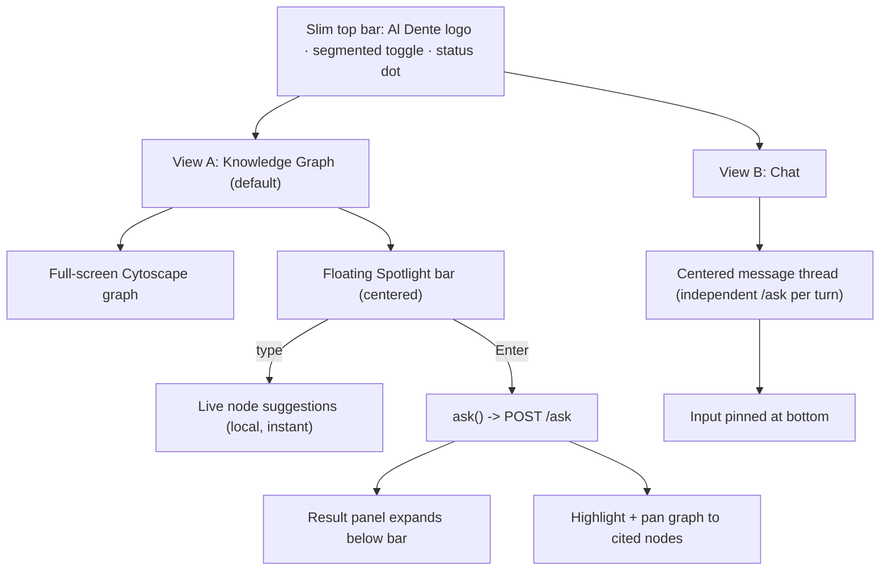

# Redesign Al Dente Company Brain UI: Graph + Chat Views

Full rewrite of [backend/static/index.html](backend/static/index.html) only. Backend is untouched; we keep the exact same endpoints: `POST /ask` -> `{answer, sources, verticale, artifact_url}` and `GET /graph-data` -> `{nodes, edges, warnings}`. Stays a single self-contained file (vanilla JS + existing CDNs: Cytoscape, fcose, `marked`). No build step, no new deps.

## Target structure

## 1. App shell and view router
- Replace the current hero + ask + workspace markup with: a slim sticky top bar (logo/mark, a centered segmented pill `Knowledge Graph | Chat`, and a minimal status dot reusing the `/graph-data` warnings logic).
- Add a tiny view-router in JS: `setView('graph'|'chat')` toggles `body` data-attribute / CSS classes; default `graph`. Cytoscape `cy.resize()` + fit on entering the graph view.
- Keyboard: `Cmd/Ctrl+K` or `/` focuses the Spotlight bar (graph view); segmented control also clickable.

## 2. Knowledge Graph view (Spotlight)
- Graph fills the viewport. Reuse the existing Cytoscape setup, `TYPES`/`LEGEND_ORDER`, styles, layout (`fcose`), tooltip, legend filters, inspector, and zoom/fit/relayout controls from the current file - re-homed into the full-screen stage and restyled minimally (controls/legend fade or appear on hover to keep it clean).
- Floating Spotlight bar, centered near the top, always visible:
  - As the user types: show instant local matches over graph nodes (reuse the `graphSearch` filter logic) as a suggestion list under the bar.
  - On Enter: call the shared `ask()` service; the suggestion list becomes a result panel that expands below the bar (Raycast/Spotlight feel), scrollable, rendering markdown answer + `verticale` badge + source chips + artifact (download link or inline HTML iframe, reusing `renderAnswer` logic).
- Answer-to-graph reaction: parse `sources` (and answer text) with the existing `NODE_ID_RE`; highlight all matched nodes and animate `cy.fit` to that set. Make source chips clickable to refocus a single node (extend existing `focusById`).
- The inspector's "Ask about this" now writes into the Spotlight bar and triggers `ask()` (instead of the old textarea).

## 3. Chat view
- Classic centered conversation column with an input composer pinned at the bottom (send button + `Cmd/Ctrl+Enter`).
- Each turn is an independent `POST /ask` (no context stuffing): rationale - the backend router (`classify_fast` in [backend/app/router.py](backend/app/router.py)) and answer cache key off the raw question; injecting prior turns risks misrouting and added latency near the 30s ceiling. History is kept client-side for the chat feel.
- Assistant bubbles render full markdown via `marked`, plus `verticale` badge, source chips, and artifacts (download link / inline HTML iframe). Clicking a source chip that maps to a graph node switches to the Graph view and focuses it (nice cross-view touch). Typing/loading indicator while awaiting `/ask`.
- This view keeps its own thread, independent from the Spotlight (per decision).

## 4. Shared ask service and helpers
- Extract one `async function ask(question)` returning the parsed JSON, reused by Spotlight and Chat (single source of truth for the fetch, error handling, and the existing degraded/error states).
- Keep helpers: `esc`, `marked.parse`, source-chip builder, artifact rendering, copy-to-clipboard.
- Surface 3-4 example prompts (reuse current `sampleExpansions`) in both empty states (Spotlight dropdown and Chat welcome) to aid demo and first use.

## 5. Visual refinement (keep warm Al Dente identity, minimal)
- Reuse the existing CSS variables/palette and fonts (Fraunces/Manrope/DM Mono) but simplify: remove the intro hero, capability chips clutter, and the dual-panel "4 boxes" layout. Tighten spacing, lean on the floating Spotlight + clean top bar. Keep grain/gradient background subtle.
- Preserve existing responsive breakpoints, restyled for the new single-view layouts.

## 6. Removed / replaced
- The intro/hero card, the separate ask composer card, and the side-by-side answer+graph workspace are removed; their functionality moves into the two views and the shared `ask()` service.

## Verification
- Run the backend locally (`uv run uvicorn app.main:app` per repo setup) and load `/`: confirm graph loads from `/graph-data`, Spotlight ask hits `/ask` and renders + highlights nodes, Chat works turn-by-turn, artifacts and degraded/error states render, and view toggle + keyboard shortcuts work. Verify mobile width.