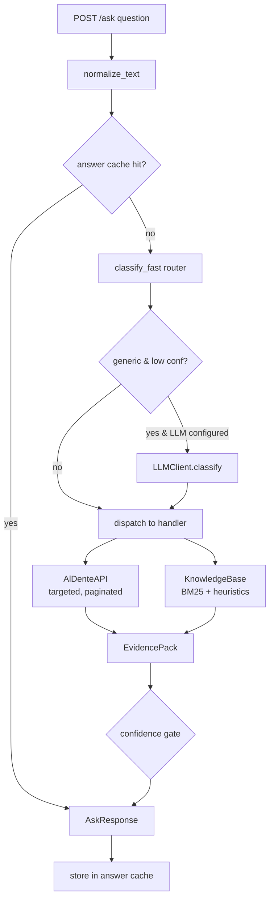

# Al Dente Company Brain — Technical Documentation

> The "company brain" of **Al Dente S.r.l.**, a pasta maker selling to supermarkets (GDO),
> distributors and restaurants (horeca). It receives a natural-language question about the
> company, decides which data sources answer it, calls them efficiently, and returns a
> grounded answer (or a generated artifact) over a single frozen HTTP endpoint.

This document is the authoritative engineering reference for the project: architecture,
request lifecycle, every module, the routing model, data sources, retrieval, the knowledge
graph, artifact generation, configuration, testing and deployment.

---

## 1. Executive summary

The system is a **deterministic-first agent**. Instead of letting an LLM free-run a
tool-calling loop (slow, non-reproducible, easy to hallucinate), the backend:

1. **Classifies** each question with a fast, rule-based router (`app/router.py`) into one of
   ~20 concrete *handlers*, each mapped to a `verticale` (`crm` / `erp` / `calls` / `kb`).
2. **Executes** a purpose-built handler that makes targeted, paginated API calls and/or KB
   retrieval, then computes every aggregate **in Python** (never in the prompt).
3. **Packs evidence** into a typed `EvidencePack` (facts, sources, confidence, missing fields).
4. **Renders** a concise, source-cited answer — or a binary/inline artifact — honoring the
   frozen `/ask` contract and a 30-second latency budget.

The LLM (Regolo.ai / Mistral, OpenAI-compatible) is **optional** and used only to classify
genuinely ambiguous questions; the evaluator-facing paths are deterministic and run without it.

Key design principles, in priority order:

- **Honesty over coverage** — traps (non-existent customers, unavailable figures such as
  profit margins) get a confident, specific "not available", never an invented number.
- **Efficiency** — calls are metered server-side per token, so handlers filter server-side,
  page only when an aggregate needs it, and search transcripts instead of downloading them.
- **Determinism** — same question ⇒ same answer; aggregates are computed in code.
- **Contract safety** — `/ask` always returns HTTP 200 with the exact JSON shape, even on
  validation or internal errors.

---

## 2. Repository layout

Everything that gets deployed lives under `backend/`. The repository root holds the challenge
briefs, reference docs and deploy config.

```
.
├── AGENTS.md                     # Full challenge spec (read by Cursor as context)
├── BRIEF.md                      # The challenge, evaluation, rules
├── API.md                        # Al Dente mock-API reference (endpoints, filters)
├── SAMPLE_QUESTIONS.md           # 12 public questions WITH reference answers
├── DEPLOY.md / DOCKER.md         # Railway deploy + Docker fallback guides
├── README.md                     # Setup / quick start
├── railway.json                  # (root copy) Railway config
└── backend/                      # ← the deployable service
    ├── main.py                   # FastAPI app: /ask, /, /health, /graph-data, /files
    ├── pyproject.toml            # Dependencies (managed by uv)
    ├── uv.lock
    ├── railway.json              # Railpack build + start command + healthcheck
    ├── .env.example              # Environment template (copy to .env)
    ├── IMPLEMENTATION_NOTES.md   # Run / validate / deploy cheatsheet
    ├── app/
    │   ├── config.py             # Settings (env vars, timeouts, cache sizing)
    │   ├── schemas.py            # AskRequest / AskResponse (frozen contract)
    │   ├── orchestrator.py       # The agent loop: route → handle → render
    │   ├── router.py             # Fast deterministic classifier (FastRoute)
    │   ├── normalizers.py        # ID/text normalization, money/number formatting
    │   ├── api_client.py         # AlDenteAPI: httpx client, retries, pagination
    │   ├── cache.py              # TTLCache (thread-safe LRU + TTL)
    │   ├── kb.py                 # KnowledgeBase (BM25 + heuristics) + extractors
    │   ├── llm.py                # LLMClient (classify + optional generation)
    │   ├── evidence.py           # EvidencePack dataclass
    │   ├── artifacts.py          # ArtifactContent + html/md/pdf/xlsx/docx/pptx renderers
    │   ├── graph.py              # GraphBuilder → cytoscape nodes/edges for the UI
    │   └── handlers/             # One module per verticale
    │       ├── __init__.py       # Context + customer resolution helpers
    │       ├── crm.py            # customers, opportunities, orders, invoices
    │       ├── erp.py            # inventory, BOM, lots, suppliers, margin trap
    │       ├── calls.py          # complaints, return qualification, defect count
    │       ├── kb_handlers.py    # product spec, price, generic KB
    │       ├── generic.py        # low-confidence fallback
    │       └── artifacts_handler.py  # deck / report builders
    ├── data/kb/                  # 35 markdown documents (the knowledge base)
    ├── static/
    │   ├── index.html            # Single-file UI + Cytoscape knowledge graph
    │   └── files/                # Generated binary artifacts, served at /files/
    ├── scripts/
    │   ├── smoke_test.py         # Credential-free health/KB/artifact/graph checks
    │   └── run_samples.py        # Runs the 12 sample questions against a base URL
    └── tests/test_core.py        # Offline unit + contract tests
```

---

## 3. Architecture

### 3.1 High-level flow



### 3.2 The agent loop (`app/orchestrator.py`)

`Orchestrator` is constructed once at startup (`main.py`) and owns the long-lived
collaborators: the API client, the knowledge base, the LLM client and four `TTLCache`
instances (API responses, full answers, the customer index, and the knowledge graph).

`Orchestrator.answer(question)` performs:

1. **Cache lookup** — keyed on the normalized question (`ask:<normalized>`). Repeated
   questions (the self-test repeats often) return in sub-millisecond time.
2. **Routing** — `classify_fast(question)` produces a `FastRoute`; if it is `generic` with
   low confidence and an LLM is configured, `_apply_llm_route` asks the LLM for a `verticale`
   hint and refines the route.
3. **Per-request `Context`** — bundles settings, API, KB, the customer cache and a
   **deadline** (`now + ask_timeout_seconds`, 28 s) so handlers can budget remaining time.
4. **Handler dispatch** — a dict maps `route.handler` → a zero-arg lambda; unknown handlers
   fall back to `generic`.
5. **Error funnel** —
   - `APIConfigurationError` (missing token) → HTTP 200 explaining KB-only mode is available.
   - `APIError` (data source failed) → HTTP 200 honest failure naming the failing path.
6. **Confidence gate** — an answerable pack with `confidence < 0.72` is downgraded to a
   "partial evidence" answer; otherwise the handler answer (or an honest "not available") is used.
7. **Response assembly** — `AskResponse(answer, sources, verticale, artifact_url)`, with
   `sources` de-duplicated while preserving order, then cached.

### 3.3 Why deterministic-first

The 30-second budget and server-side metering make a free-running LLM tool loop risky: every
step is an extra round-trip and an extra metered API call, and the model can hallucinate
addends or entities. By routing to specialized handlers that own their exact API call
sequence and do arithmetic in Python, the system is faster (typical 4–10 s, p95 well under
the cap), reproducible, and far harder to trick on trap questions.

---

## 4. The public contract — `POST /ask`

Defined in `app/schemas.py` and served by `main.py`. **The signature is frozen** — the
evaluator does one POST and reads one JSON response.

**Request**

```json
{ "question": "How many open opportunities does CUST-0132 have?" }
```

**Response**

```json
{
  "answer": "string — natural language, or inline HTML/markdown artifact",
  "sources": ["crm/opportunities", "DOC-015"],
  "verticale": "crm | erp | calls | kb",
  "artifact_url": "absolute URL | null"
}
```

### 4.1 Hard guarantees (enforced in code)

| Guarantee | Where it is enforced |
| --- | --- |
| Path is exactly `/ask`, method `POST` | `@app.post("/ask")` in `main.py` |
| No authentication required | No auth dependency on the route |
| HTTP 200 for *every* outcome, including "not available" | `ask()` try/except + validation handler |
| Invalid body still returns the contract shape | `validation_error` handler returns 200 + valid `AskResponse` |
| Single synchronous JSON object, no streaming, no job pattern | Plain `return AskResponse(...)` |
| `verticale` ∈ {crm, erp, calls, kb} | `Verticale = Literal[...]` in `schemas.py` |
| `artifact_url` only for binary files (docx/pptx/pdf/xlsx) | Inline HTML/MD keep it `null` |
| Latency < 30 s | `ask_timeout_seconds = 28` deadline + 5 s per-call timeouts |

### 4.2 Other routes

| Route | Purpose |
| --- | --- |
| `GET /` | Serves `static/index.html` (the UI + knowledge graph). |
| `GET /health` | `{"status": "ok"}` — Railway healthcheck, no auth. |
| `GET /graph-data` | Cytoscape-ready `{nodes, edges, warnings}` for the UI graph. |
| `GET /files/{name}` | Static serving of generated binary artifacts. |

---

## 5. Routing model (`app/router.py`)

`classify_fast(question)` is the heart of the system. It normalizes the text, extracts IDs,
detects artifact intent, then runs an **ordered** sequence of keyword/regex rules. The first
match wins, so rules are ordered by specificity and trap-priority. It returns a `FastRoute`:

```python
@dataclass
class FastRoute:
    handler: str            # which handler function to run
    verticale: Verticale    # crm | erp | calls | kb
    confidence: float       # 0..1 — gates the final answer and LLM fallback
    entities: dict          # extracted IDs by type
    artifact_type: str | None
    classification: dict    # filled in if the LLM refines the route
```

### 5.1 Handler reference

Every route resolves to one handler. The dispatch table lives in `Orchestrator.answer`.

| Handler | Verticale | Triggers (abridged) | What it does |
| --- | --- | --- | --- |
| `artifact` | dominant | "generate/create/make/deck/report", or explicit `pdf/xlsx/docx/pptx/html/markdown` | Builds a deck/report and renders inline or as a binary file. |
| `erp_margin_trap` | erp | "profit margin", "gross/net margin", lot + "cost of" | **Trap** — confidently reports margin/cost are not in any source. |
| `crm_opportunity_lookup` | crm | an `OPP-####` id | Looks up one opportunity, joins its customer. |
| `crm_negotiation_by_channel` | crm | "negotiation" + "grouped by / channel / gdo" | Aggregates negotiation pipeline by customer channel. |
| `crm_open_opportunities` | crm | "open opportunit…" + "how many / total value / worth" | Counts + totals qualification+negotiation deals for a customer. |
| `crm_account_brief` | crm | "account/customer profile/brief" | Profile + open deals + latest order + complaint count. |
| `crm_customer_lookup` | crm | a `CUST-####` id, or "customer named/called/exists" | Resolves and describes a customer (or honest "not found"). |
| `calls_price_conflict` | kb | "price" + "call mentions / authoritative / conflict" | Official price (DOC-015) vs. a figure mentioned in a call. |
| `calls_return_qualification` | calls | "qualify/eligible for a return", "under the quality policy" | Checks a complaint against DOC-011's return conditions. |
| `calls_defect_count` | calls | "across all" + "call" + "count/how many/defect" | Counts complaints for a defect across **all** calls (parallel transcript search). |
| `calls_latest_complaint` | calls | "call" + "complaint / which lot / last/latest call" | Finds the latest complaint call, extracts defect + lot + SKU. |
| `erp_bom_chain` | erp | "bill of materials/bom/which semolina/raw material" + a SKU | SKU → BOM component → inventory level → supplier. |
| `erp_supplier_materials` | erp | a `SUP-###` id, or "supplier … provides/supplies" | Which inventory materials a supplier provides. |
| `erp_inventory` | erp | "below minimum / minimum stock / on-hand" | Is a SKU below its minimum stock (with quantities)? |
| `erp_lot_status` | erp | a `LOT-####-####` id, or lot/SKU + status/production | Production lot status, SKU, order. |
| `kb_product_spec` | kb | "shelf life / tmc / allergen / may contain / product spec" | Shelf life + allergens + may-contain from spec sheet. |
| `kb_price` | kb | "price" + a SKU or "list price" | Official 2026 wholesale list price for a SKU (DOC-015). |
| `erp_shipment_status` | erp | "shipment" + "status/late/delayed/delivery" | Latest shipment status (handled by `handle_order_status`). |
| `crm_order_status` | crm | "order status / invoice / shipment" | Latest order + invoice status (and shipment if asked). |
| `kb_generic` | kb | "policy / procedure / haccp / quality / label / sustainability …" | Retrieves the relevant policy doc(s) and excerpts them. |
| `generic` | crm (0.2) | nothing else matched | LLM-assisted fallback; defaults to KB or honest abstention. |

### 5.2 LLM fallback

`needs_llm_classification` returns `True` only when the route is `generic`, confidence `< 0.5`
and the question is longer than 8 characters. In that case `LLMClient.classify` returns a JSON
hint that can override the `verticale` and switch the handler to `kb_generic`. If no LLM is
configured (or it fails), the route is used as-is — the system never blocks on the model.

---

## 6. Data sources

The agent may use **only** two source families (no external or invented data):

1. The **Al Dente mock APIs** — read-only, JSON, paginated, token-authenticated.
2. The **knowledge base** — 35 markdown files in `backend/data/kb/`.

### 6.1 The Al Dente APIs (`app/api_client.py`)

`AlDenteAPI` wraps a single persistent `httpx.Client` (base URL + 5 s timeout) and adds:

- **Auth** — `Authorization: Bearer <MOCK_API_TOKEN>` on every call; a missing token raises
  `APIConfigurationError` (surfaced as a graceful HTTP-200 message).
- **Caching** — every GET is cached in a `TTLCache` keyed by `path + sorted(params)`, so the
  same lookup within a request (or across repeated questions) is free and unmetered.
- **Retries** — two attempts with a 0.2 s backoff on `5xx`/transport errors; `4xx` fails fast.
- **`list_all(path, params, max_pages)`** — the pagination-aware aggregator. It pages with
  `limit=200`, reads `pagination.total`, and keeps fetching until all rows are collected. This
  is what prevents the single most common wrong answer ("counted only the first page").
- **Convenience methods** per endpoint: `search_customers`, `get_customer`,
  `list_opportunities`, `list_orders`, `list_invoices`, `list_calls`, `get_call`,
  `search_transcript`, `list_production_orders`, `find_production_order_by_lot`,
  `list_inventory`, `list_suppliers`, `get_bom`, `list_shipments`.
- **BOM flattening** — `get_bom(sku)` normalizes both flat and nested (`components: [...]`)
  shapes into a flat component list, carrying the parent SKU/name onto each component.
- **Transcript search** — `search_transcript(call_id, search=…)` pulls only matching segments
  (under the `segments` key, not `data`), never the full transcript.

Endpoints and exact-match, case-sensitive filters (see `API.md` for the full table):

| Endpoint | Key filters |
| --- | --- |
| `GET /crm/customers` (+ `/{id}`) | `search`, `channel` (GDO/distributor/horeca), `status` |
| `GET /crm/opportunities` | `customer_id`, `stage` (qualification/negotiation/won/lost), `owner` |
| `GET /crm/orders` | `customer_id`, `status`, `from`, `to` |
| `GET /crm/invoices` | `customer_id`, `status`, `order_id` |
| `GET /calls` (+ `/{id}`, `/{id}/transcript`) | `customer_id`, `type`, `outcome`; transcript: `search`, `speaker` |
| `GET /erp/production-orders` | `customer_id`, `status`, `sku`, `from`, `to` |
| `GET /erp/inventory` | `type`, `below_min=true`, `search` |
| `GET /erp/suppliers` | `search`, `category` |
| `GET /erp/bom` | `sku` |
| `GET /erp/shipments` | `customer_id`, `order_id`, `status` |

**ID conventions** (used by the extractors and the graph): `CUST-####`, `OPP-####`,
`ORD-2026-####`, `LOT-2026-####`, `PAS-XXX-###` (finished SKU), `RAW-XXX-###` (raw material),
`SUP-###`, `CALL-#####`, `DOC-###`.

### 6.2 The knowledge base (`app/kb.py`)

35 small, mutually-similar markdown documents: 18 product spec sheets (shelf life, allergens,
formats, including Bio and 250g variants), quality/returns/HACCP/allergen/traceability
policies, supplier agreements, logistics SLAs, the wholesale price list, and the GDO
capitolato.

**Retrieval strategy — whole-document, hybrid scoring.** Because the docs are short and
near-duplicate, fragment chunking hurts (it separates shelf life from allergens). Each file is
loaded once (lazily, thread-safe) into a `KBDoc` with its `doc_id`, `title`, full `text`,
tokenized text and detected `sku`. `KnowledgeBase.search` blends:

- **BM25** (`rank_bm25.BM25Okapi`) over normalized tokens, normalized to `[0,1]`.
- **Exact-ID boost** (`+4.0`) when a `DOC-###` appears literally in the query.
- **SKU boost** (`+3.0`) when the document's SKU appears in the query.
- **Substring boost** (`+2.0`) when the normalized query is a substring of the document.
- **Token-overlap** bonus (Jaccard-like, capped at `+1.0`).

Specialized helpers: `search_by_id` (direct doc fetch), `search_product` (prefers spec
sheets), `search_policy`.

**Structured extractors** (regex over the markdown, so numbers are exact, never paraphrased):

| Extractor | Returns |
| --- | --- |
| `extract_product_spec` | `sku`, `product`, `shelf_life`, `allergens`, `may_contain` |
| `extract_price_for_sku` | `sku`, `product`, `price`, `currency`, `unit` |
| `extract_return_policy_terms` | `window_days`, required evidence, covered defects, exclusions, outcomes |
| `relevant_excerpt` | top sentences scored by query-token overlap |

**Authoritative documents** are hard-pinned where correctness matters: **DOC-011** (Returns &
Quality Complaints Policy) for returns decisions, **DOC-015** (Wholesale Price List 2026) for
prices.

---

## 7. The evidence model (`app/evidence.py`)

Every handler returns an `EvidencePack` — the single contract between handlers and the
orchestrator:

```python
@dataclass
class EvidencePack:
    answerable: bool          # did we actually find the answer?
    verticale: Verticale      # dominant source for this answer
    facts: dict               # includes "answer" (the rendered text) + raw records
    sources: list[str]        # endpoint ids / doc ids actually used
    missing: list[str]        # named fields that were required but absent
    warnings: list[str]
    confidence: float         # 0..1 — gated at 0.72 by the orchestrator
    artifact_url: str | None
```

Conventions that make the system honest and traceable:

- `answer` lives inside `facts["answer"]`; the raw records are kept alongside for artifacts.
- `sources` contains the *real* paths/ids touched (e.g. `crm/opportunities`, `calls/CALL-58020/transcript`, `DOC-011`).
- A "found-but-thin" result sets `answerable=False` with a precise message, so the orchestrator
  never upgrades a guess into a confident answer.
- `confidence` encodes how sure the handler is; multi-hop chains that miss a link drop it
  below the `0.72` gate and produce a "partial evidence" answer instead of a fabricated one.

---

## 8. Handlers (`app/handlers/`)

Handlers share a `Context` (settings, API, KB, customer cache, deadline) and a set of helpers
in `handlers/__init__.py`, most importantly **customer resolution**.

### 8.1 Customer resolution (`resolve_customer`)

A recurring need (CRM, calls, artifacts) is turning a free-text company name into a CRM record
without false positives (traps include made-up customers). The resolver:

1. If a `CUST-####` id is present, fetches it directly (404 ⇒ confident "not found").
2. Otherwise extracts a candidate company phrase (`extract_customer_phrase`), searches the CRM
   `search` filter, and normalizes names (`normalize_company_name` strips `S.p.A./S.r.l.`).
3. Accepts an **exact** normalized match, or a high `rapidfuzz` score with a clear margin over
   the runner-up; otherwise returns `found=False` with up to 3 `ambiguous` candidates.

This yields specific answers like *"I could not find any customer named X in the CRM"* (trap)
or *"the name X is ambiguous: …"* rather than a wrong match.

### 8.2 CRM (`crm.py`)

- `handle_customer_lookup` — resolve + describe (channel, status, location).
- `handle_opportunity_lookup` — one `OPP-####`, joined with its customer.
- `handle_open_opportunities` — counts and **sums in Python** the qualification+negotiation
  deals for a customer (`format_money` on a `Decimal` total).
- `handle_negotiation_by_channel` — group-by aggregate: pulls negotiation opportunities, maps
  customers→channel, totals value and count per `GDO / distributor / horeca`, and warns if any
  opportunity references a customer the CRM didn't return.
- `handle_order_status` — latest order (+ invoice statuses), or a shipment branch
  (ERP `shipments`) when the question mentions shipment/delivery; honest "no order/shipment".
- `handle_account_brief` — profile + open pipeline + last 3 orders + recent complaint count.

### 8.3 ERP (`erp.py`)

- `handle_inventory` — resolves a SKU (from the question or KB), fetches the exact inventory
  row, compares on-hand vs. minimum with `Decimal`, answers Yes/No with quantities.
- `handle_bom_chain` — multi-hop: SKU → BOM component (optionally filtered to *semolina*) →
  raw-material inventory level → supplier. Confidence is high only when raw SKU + inventory +
  supplier are all resolved; otherwise it drops to ~0.62 and lists what's missing.
- `handle_lot_status` — resolves a lot by id (with optional customer/SKU/order constraints) or
  the newest matching production order; returns status + SKU + order.
- `handle_margin_trap` — **the canonical trap handler**. If a referenced lot doesn't exist it
  says so; otherwise it states that cost/profit margin are not stored anywhere in the sources
  (`confidence=0.99`, `answerable=False`). Inventing a margin scores heavily negative.
- `handle_supplier_materials` — resolves a supplier by id/name, then lists inventory materials
  referencing that supplier.

### 8.4 Calls (`calls.py`)

- `handle_latest_complaint` — finds the latest complaint call for a customer (or a given
  `CALL-#####`), then **targeted transcript search** for the defect term, extracting the
  covered defect, lot id, product and SKU. Answerable only with both defect and lot.
- `handle_return_qualification` — chains on the complaint, loads **DOC-011**, and checks each
  condition (covered defect, lot number present, photo evidence, within the 15-day window, no
  exclusion). It pulls only the extra transcript segments it still needs (photo / days). The
  answer is a clear Yes (with policy outcomes) or a precise list of failing conditions.
- `handle_defect_count` — an "across ALL calls" aggregate. It lists every call, then runs
  transcript searches **in parallel** (`ThreadPoolExecutor`, up to 32 workers) with careful
  negation handling (`not <defect>`); if any transcript search fails it refuses to give an
  exact count rather than undercount.
- `handle_price_conflict` — reconciles a price mentioned in a call against the authoritative
  list price in DOC-015, stating DOC-015 is authoritative and flagging the call figure.

### 8.5 KB (`kb_handlers.py`) and fallback (`generic.py`)

- `handle_product_spec` — spec-sheet retrieval + `extract_product_spec` → shelf life,
  declared allergens, may-contain.
- `handle_price` — DOC-015 list price for a SKU, formatted per carton, ex-VAT.
- `handle_generic_kb` — pins DOC-011 for returns/quality questions, otherwise retrieves the
  top documents and returns query-relevant excerpts with their doc ids as sources.
- `handle_generic` — last resort: routes obvious KB/policy/product questions to the KB,
  otherwise returns an honest, specific abstention.

---

## 9. Artifact generation (`app/artifacts.py` + `handlers/artifacts_handler.py`)

Generation questions come in two flavors, both judged first on **facts** (real data must be
present) and on respecting the requested format.

- **Inline** (`html` / `markdown`) — returned directly in `answer`; `artifact_url` stays
  `null`. Used for decks and reports rendered in the browser.
- **Binary** (`pdf` / `xlsx` / `docx` / `pptx`) — written to `static/files/` and returned as
  an absolute `artifact_url` (`{PUBLIC_BASE_URL}/files/<name>`), served by the `/files` mount.

`handle_artifact` first builds an `ArtifactContent` (title, subtitle, sections, table columns
+ rows, sources) from one of four builders, then renders it in the requested format:

| Builder | Verticale | Content |
| --- | --- | --- |
| `_customer_deck` | crm | Account brief: profile, open deals, orders+lots, complaint calls. |
| `_negotiation_report` | crm | Negotiation pipeline grouped by customer channel. |
| `_inventory_report` | erp | Below-minimum inventory with on-hand / minimum / gap. |
| `_kb_report` | kb | Grounded summary from a product-spec or generic-KB lookup. |

The renderers all consume the same `ArtifactContent`:

- `render_inline_html` / `render_inline_markdown` — styled deck / clean markdown.
- `write_pdf` (fpdf2), `write_xlsx` (openpyxl, with header styling, freeze panes, auto-filter
  and a Notes sheet), `write_docx` (python-docx), `write_pptx` (python-pptx).

All share the Al Dente brand palette (espresso `#1D1712`, gold `#E8B44F`, tomato `#DB553D`,
cream `#FFF5DF`). Binary filenames are timestamped + random (`artifact_<ts>_<hex>.<ext>`).

---

## 10. Knowledge graph (`app/graph.py` + UI)

A required, jury-scored deliverable. `GraphBuilder.build()` returns a Cytoscape-ready payload
`{nodes, edges, warnings}` and is cached (`graph_cache`) so the UI loads instantly on repeat.

- It always seeds the **KB layer**: a `Policies` hub, every `DOC-###`, and `specifies` edges
  from spec sheets to their `PAS-` products.
- With a token configured, it pages a **bounded** sample (e.g. 20 active customers, negotiation
  + qualification opportunities, orders, lots, calls, inventory, suppliers) and links them:
  customers→opportunities/orders/calls, orders→lots→SKUs, suppliers→materials, and a few
  finished SKUs→BOM raw materials→suppliers (the materials/supply network the brief asks for).
- Node types: `customer`, `opportunity`, `order`, `lot`, `product`, `raw_material`,
  `supplier`, `call`, `kb_doc`, `hub`. Unknown ids are typed by prefix.
- **Graceful degradation** — no token ⇒ it returns just the local KB graph with a warning;
  per-endpoint failures are collected into `warnings` rather than failing the whole build.

### The UI (`backend/static/index.html`)

A single self-contained file (no build step) themed as an Al Dente "company intelligence
system". It provides:

- An **ask composer** (with ⌘/Ctrl+Enter), sample-question chips that expand to full prompts,
  a loading state, and rendered answers via `marked` (markdown) — HTML artifacts render in a
  sandboxed `<iframe>`, binary artifacts show a download link, and `sources` + `verticale`
  appear as badges.
- A **live knowledge graph** via Cytoscape (`/graph-data`), color-coded by node type, with
  type filters (customers / products / materials / knowledge), a detail drawer per node, and a
  "**Ask about this node**" button that turns any node into a tailored question — closing the
  loop between the graph and the agent.

---

## 11. Supporting modules

### `app/normalizers.py`
Pure, dependency-light helpers used everywhere:
- `normalize_text` (accent-fold, lowercase, collapse to alphanumerics) and
  `normalize_company_name` (also strips legal suffixes).
- `extract_ids` — regex map of all entity-id types found in a question.
- `is_aggregate_question`, `is_artifact_request` (+ artifact type), `extract_customer_phrase`.
- `as_decimal` / `format_number` / `format_money` — locale-tolerant numeric parsing and
  formatting so arithmetic is exact (`Decimal`) and money renders consistently.
- `sort_records_newest`, `first_value`, `record_id`, `compact_record` — record utilities.

### `app/cache.py`
`TTLCache` — a thread-safe (`RLock`) `OrderedDict` with per-entry TTL and LRU eviction.
Instances back API responses, full answers, the customer index and the graph.

### `app/config.py`
`Settings` (pydantic `BaseModel`) loads `backend/.env` via `python-dotenv`. It accepts the
documented `MOCK_API_*` names plus legacy `ALDENTE_*` fallbacks, exposes `has_mock_api` /
`has_llm` guards, and is memoized with `lru_cache`. Tunable timeouts/caching:
`request_timeout_seconds=5`, `llm_timeout_seconds=5`, `ask_timeout_seconds=28`,
`cache_ttl_seconds=900`, `cache_max_entries=512`.

### `app/llm.py`
`LLMClient` wraps the OpenAI SDK against `LLM_BASE_URL`. `classify` returns a strict JSON route
hint; `final_answer` / `generate_artifact_html` exist for optional generation. It handles the
provider gotcha where reasoning models put text in `reasoning_content` instead of `content`,
and **fails soft** (returns `{}`/`""`) so the deterministic path always proceeds.

---

## 12. Configuration

All configuration is environment-based (`backend/.env`, copied from `.env.example`). **Never
commit `.env`** — it is git-ignored.

| Variable | Required | Purpose |
| --- | --- | --- |
| `LLM_BASE_URL` | optional | `https://api.regolo.ai/v1` or `https://api.mistral.ai/v1`. |
| `LLM_API_KEY` | optional | Provider key (only enables the LLM classification fallback). |
| `MODEL` | optional | Model id — **case-sensitive on Regolo**; must support tool/JSON output. |
| `MOCK_API_BASE_URL` | yes | `https://aldente.yellowtest.it`. |
| `MOCK_API_TOKEN` | yes | Personal token from the platform dashboard; also identifies metering. |
| `PUBLIC_BASE_URL` | for artifacts | Public URL of this backend, used to build `artifact_url`. |

Without `MOCK_API_TOKEN`, KB-only questions still work; API-backed questions return a graceful
HTTP-200 message. Without an LLM, only the (rare) ambiguous-question fallback is unavailable.

---

## 13. Running locally

```bash
cd backend/
cp .env.example .env        # fill in MOCK_API_TOKEN (+ optional LLM keys)
uv sync
uv run uvicorn main:app --reload --port 8000
```

Open `http://localhost:8000` for the UI, `http://localhost:8000/docs` for OpenAPI.

Dependencies (managed by `uv`, see `pyproject.toml`): `fastapi`, `uvicorn[standard]`, `httpx`,
`openai`, `python-dotenv`, `rank-bm25`, `rapidfuzz`, and the artifact libraries `fpdf2`,
`openpyxl`, `python-docx`, `python-pptx`.

---

## 14. Testing & validation

| Command | What it checks |
| --- | --- |
| `uv run python -m unittest discover -s tests -v` | Offline unit + contract tests — pagination uses `total`, BOM flattening, router routing, and the `/ask` contract (HTTP 200 on bad input, inline HTML keeps `artifact_url` null, KB source ids). |
| `uv run python scripts/smoke_test.py` | Credential-free health / UI / KB / binary-artifact / graph checks (CRM check runs only if `MOCK_API_TOKEN` is set). |
| `uv run python scripts/run_samples.py --base-url <url>` | Runs the 12 public `SAMPLE_QUESTIONS.md` questions and verifies the reference facts and `verticale` for each. |

The offline test suite (7 tests) passes with no credentials. `run_samples.py` covers the four
verticali, the pagination aggregates (samples 1, 6, 11), the traps (samples 7, 8), the
multi-source chains (samples 5, 10, 12) and the artifact cases (sample 9).

---

## 15. Deployment (Railway)

The `backend/` folder deploys as a **single service** — it serves `/ask`, the UI, the graph
and the artifacts; no separate frontend, no CORS, no Dockerfile (Railpack builds from
`pyproject.toml` + `uv.lock`, driven by `railway.json`).

```bash
cd backend/
railway init
railway up
railway variables --set MOCK_API_BASE_URL=https://aldente.yellowtest.it \
  --set MOCK_API_TOKEN=<token> --set LLM_BASE_URL=... --set LLM_API_KEY=... --set MODEL=...
railway domain                                   # → the URL you submit
railway variables --set PUBLIC_BASE_URL=https://<generated-domain>
```

`railway.json` sets the start command (`uvicorn` on `$PORT`), the `/health` healthcheck and an
on-failure restart policy. After deploying, set `PUBLIC_BASE_URL` (else artifact links point to
localhost), then run the platform endpoint check before submitting. See `DEPLOY.md` for the
full walkthrough.

---

## 16. Design decisions & trade-offs

- **Deterministic router over an LLM tool loop** — predictable latency, reproducible answers,
  resistance to trap questions, and minimal metered API usage. The LLM is a thin, optional
  fallback, not the engine.
- **Whole-document retrieval** — the KB docs are short and near-duplicate; retrieving whole
  docs keeps shelf life and allergens together and beats aggressive chunking. BM25 is augmented
  with exact-id/SKU/substring boosts so code-exact lookups land on the right document.
- **Arithmetic in Python, never in the prompt** — totals, counts and group-bys use `Decimal`
  over fully-paginated rows, eliminating the most common aggregation errors.
- **Honest abstention as a first-class outcome** — trap handlers (`erp_margin_trap`, strict
  customer resolution) return confident, specific "not available" answers; the `0.72`
  confidence gate prevents thin evidence from becoming a confident guess.
- **Fail-soft everywhere** — missing token, API errors, LLM errors and even unhandled
  exceptions all resolve to a valid HTTP-200 contract response, because a 5xx scores worse than
  an honest abstention.
- **Efficiency by construction** — server-side filters, `pagination.total`-aware paging only
  when needed, transcript `search` instead of full downloads, and aggressive TTL caching of API
  responses, answers and the graph.

---

## 17. Change log

- **2026-06-13: Initial technical documentation**
  - *Details*: Authored this end-to-end `DOCUMENTATION.md` after a full read of the backend
    (orchestrator, router, API client, KB/RAG, handlers, evidence model, artifacts, graph),
    the UI, the scripts and the tests. No source code was modified.
  - *Tech notes*: No new dependencies or endpoints. Verified the offline suite
    (`uv run python -m unittest discover -s tests`) — 7/7 passing — to confirm the documented
    behavior reflects the working state.


