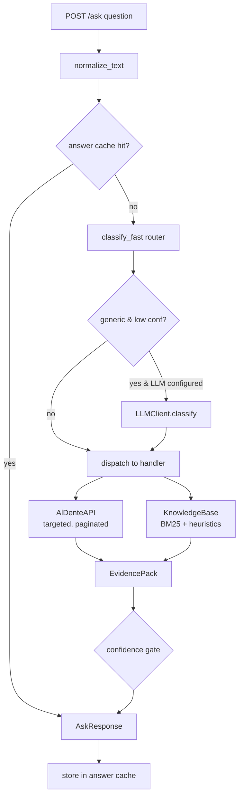

# Al Dente Company Brain — Technical Documentation

> The "company brain" of **Al Dente S.r.l.**, a pasta maker selling to supermarkets (GDO),
> distributors and restaurants (horeca). It receives a natural-language question about the
> company, decides which data sources answer it, calls them efficiently, and returns a
> grounded answer (or a generated artifact) over a single frozen HTTP endpoint.

This document is the authoritative engineering reference for the project: architecture,
request lifecycle, every module, the routing model, data sources, retrieval, the knowledge
graph, artifact generation, configuration, testing and deployment.

---

## 1. Executive summary

The system is a **deterministic-first agent**. Instead of letting an LLM free-run a
tool-calling loop (slow, non-reproducible, easy to hallucinate), the backend:

1. **Classifies** each question with a fast, rule-based router (`app/router.py`) into one of
   ~20 concrete *handlers*, each mapped to a `verticale` (`crm` / `erp` / `calls` / `kb`).
2. **Executes** a purpose-built handler that makes targeted, paginated API calls and/or KB
   retrieval, then computes every aggregate **in Python** (never in the prompt).
3. **Packs evidence** into a typed `EvidencePack` (facts, sources, confidence, missing fields).
4. **Renders** a concise, source-cited answer — or a binary/inline artifact — honoring the
   frozen `/ask` contract and a 30-second latency budget.

The LLM (Regolo.ai / Mistral, OpenAI-compatible) is **optional** and used only to classify
genuinely ambiguous questions; the evaluator-facing paths are deterministic and run without it.

Key design principles, in priority order:

- **Honesty over coverage** — traps (non-existent customers, unavailable figures such as
  profit margins) get a confident, specific "not available", never an invented number.
- **Efficiency** — calls are metered server-side per token, so handlers filter server-side,
  page only when an aggregate needs it, and search transcripts instead of downloading them.
- **Determinism** — same question ⇒ same answer; aggregates are computed in code.
- **Contract safety** — `/ask` always returns HTTP 200 with the exact JSON shape, even on
  validation or internal errors.

---

## 2. Repository layout

Everything that gets deployed lives under `backend/`. The repository root holds the challenge
briefs, reference docs and deploy config.

```
.
├── AGENTS.md                     # Full challenge spec (read by Cursor as context)
├── BRIEF.md                      # The challenge, evaluation, rules
├── API.md                        # Al Dente mock-API reference (endpoints, filters)
├── SAMPLE_QUESTIONS.md           # 12 public questions WITH reference answers
├── DEPLOY.md / DOCKER.md         # Railway deploy + Docker fallback guides
├── README.md                     # Setup / quick start
├── railway.json                  # (root copy) Railway config
└── backend/                      # ← the deployable service
    ├── main.py                   # FastAPI app: /ask, /, /health, /graph-data, /files
    ├── pyproject.toml            # Dependencies (managed by uv)
    ├── uv.lock
    ├── railway.json              # Railpack build + start command + healthcheck
    ├── .env.example              # Environment template (copy to .env)
    ├── IMPLEMENTATION_NOTES.md   # Run / validate / deploy cheatsheet
    ├── app/
    │   ├── config.py             # Settings (env vars, timeouts, cache sizing)
    │   ├── schemas.py            # AskRequest / AskResponse (frozen contract)
    │   ├── orchestrator.py       # The agent loop: route → handle → render
    │   ├── router.py             # Fast deterministic classifier (FastRoute)
    │   ├── normalizers.py        # ID/text normalization, money/number formatting
    │   ├── api_client.py         # AlDenteAPI: httpx client, retries, pagination
    │   ├── cache.py              # TTLCache (thread-safe LRU + TTL)
    │   ├── kb.py                 # KnowledgeBase (BM25 + heuristics) + extractors
    │   ├── llm.py                # LLMClient (classify + optional generation)
    │   ├── evidence.py           # EvidencePack dataclass
    │   ├── artifacts.py          # ArtifactContent + html/md/pdf/xlsx/docx/pptx renderers
    │   ├── graph.py              # GraphBuilder → cytoscape nodes/edges for the UI
    │   └── handlers/             # One module per verticale
    │       ├── __init__.py       # Context + customer resolution helpers
    │       ├── crm.py            # customers, opportunities, orders, invoices
    │       ├── erp.py            # inventory, BOM, lots, suppliers, margin trap
    │       ├── calls.py          # complaints, return qualification, defect count
    │       ├── kb_handlers.py    # product spec, price, generic KB
    │       ├── generic.py        # low-confidence fallback
    │       └── artifacts_handler.py  # deck / report builders
    ├── data/kb/                  # 35 markdown documents (the knowledge base)
    ├── static/
    │   ├── index.html            # Single-file UI + Cytoscape knowledge graph
    │   └── files/                # Generated binary artifacts, served at /files/
    ├── scripts/
    │   ├── smoke_test.py         # Credential-free health/KB/artifact/graph checks
    │   └── run_samples.py        # Runs the 12 sample questions against a base URL
    └── tests/test_core.py        # Offline unit + contract tests
```

---

## 3. Architecture

### 3.1 High-level flow



### 3.2 The agent loop (`app/orchestrator.py`)

`Orchestrator` is constructed once at startup (`main.py`) and owns the long-lived
collaborators: the API client, the knowledge base, the LLM client and four `TTLCache`
instances (API responses, full answers, the customer index, and the knowledge graph).

`Orchestrator.answer(question)` performs:

1. **Cache lookup** — keyed on the normalized question (`ask:<normalized>`). Repeated
   questions (the self-test repeats often) return in sub-millisecond time.
2. **Routing** — `classify_fast(question)` produces a `FastRoute`; if it is `generic` with
   low confidence and an LLM is configured, `_apply_llm_route` asks the LLM for a `verticale`
   hint and refines the route.
3. **Per-request `Context`** — bundles settings, API, KB, the customer cache and a
   **deadline** (`now + ask_timeout_seconds`, 28 s) so handlers can budget remaining time.
4. **Handler dispatch** — a dict maps `route.handler` → a zero-arg lambda; unknown handlers
   fall back to `generic`.
5. **Error funnel** —
   - `APIConfigurationError` (missing token) → HTTP 200 explaining KB-only mode is available.
   - `APIError` (data source failed) → HTTP 200 honest failure naming the failing path.
6. **Confidence gate** — an answerable pack with `confidence < 0.72` is downgraded to a
   "partial evidence" answer; otherwise the handler answer (or an honest "not available") is used.
7. **Response assembly** — `AskResponse(answer, sources, verticale, artifact_url)`, with
   `sources` de-duplicated while preserving order, then cached.

### 3.3 Why deterministic-first

The 30-second budget and server-side metering make a free-running LLM tool loop risky: every
step is an extra round-trip and an extra metered API call, and the model can hallucinate
addends or entities. By routing to specialized handlers that own their exact API call
sequence and do arithmetic in Python, the system is faster (typical 4–10 s, p95 well under
the cap), reproducible, and far harder to trick on trap questions.

---

## 4. The public contract — `POST /ask`

Defined in `app/schemas.py` and served by `main.py`. **The signature is frozen** — the
evaluator does one POST and reads one JSON response.

**Request**

```json
{ "question": "How many open opportunities does CUST-0132 have?" }
```

**Response**

```json
{
  "answer": "string — natural language, or inline HTML/markdown artifact",
  "sources": ["crm/opportunities", "DOC-015"],
  "verticale": "crm | erp | calls | kb",
  "artifact_url": "absolute URL | null"
}
```

### 4.1 Hard guarantees (enforced in code)

| Guarantee | Where it is enforced |
| --- | --- |
| Path is exactly `/ask`, method `POST` | `@app.post("/ask")` in `main.py` |
| No authentication required | No auth dependency on the route |
| HTTP 200 for *every* outcome, including "not available" | `ask()` try/except + validation handler |
| Invalid body still returns the contract shape | `validation_error` handler returns 200 + valid `AskResponse` |
| Single synchronous JSON object, no streaming, no job pattern | Plain `return AskResponse(...)` |
| `verticale` ∈ {crm, erp, calls, kb} | `Verticale = Literal[...]` in `schemas.py` |
| `artifact_url` only for binary files (docx/pptx/pdf/xlsx) | Inline HTML/MD keep it `null` |
| Latency < 30 s | `ask_timeout_seconds = 28` deadline + 5 s per-call timeouts |

### 4.2 Other routes

| Route | Purpose |
| --- | --- |
| `GET /` | Serves `static/index.html` (the UI + knowledge graph). |
| `GET /health` | `{"status": "ok"}` — Railway healthcheck, no auth. |
| `GET /graph-data` | Cytoscape-ready `{nodes, edges, warnings}` for the UI graph. |
| `GET /files/{name}` | Static serving of generated binary artifacts. |

---

## 5. Routing model (`app/router.py`)

`classify_fast(question)` is the heart of the system. It normalizes the text, extracts IDs,
detects artifact intent, then runs an **ordered** sequence of keyword/regex rules. The first
match wins, so rules are ordered by specificity and trap-priority. It returns a `FastRoute`:

```python
@dataclass
class FastRoute:
    handler: str            # which handler function to run
    verticale: Verticale    # crm | erp | calls | kb
    confidence: float       # 0..1 — gates the final answer and LLM fallback
    entities: dict          # extracted IDs by type
    artifact_type: str | None
    classification: dict    # filled in if the LLM refines the route
```

### 5.1 Handler reference

Every route resolves to one handler. The dispatch table lives in `Orchestrator.answer`.

| Handler | Verticale | Triggers (abridged) | What it does |
| --- | --- | --- | --- |
| `artifact` | dominant | "generate/create/make/deck/report", or explicit `pdf/xlsx/docx/pptx/html/markdown` | Builds a deck/report and renders inline or as a binary file. |
| `erp_margin_trap` | erp | "profit margin", "gross/net margin", lot + "cost of" | **Trap** — confidently reports margin/cost are not in any source. |
| `crm_opportunity_lookup` | crm | an `OPP-####` id | Looks up one opportunity, joins its customer. |
| `crm_negotiation_by_channel` | crm | "negotiation" + "grouped by / channel / gdo" | Aggregates negotiation pipeline by customer channel. |
| `crm_open_opportunities` | crm | "open opportunit…" + "how many / total value / worth" | Counts + totals qualification+negotiation deals for a customer. |
| `crm_account_brief` | crm | "account/customer profile/brief" | Profile + open deals + latest order + complaint count. |
| `crm_customer_lookup` | crm | a `CUST-####` id, or "customer named/called/exists" | Resolves and describes a customer (or honest "not found"). |
| `calls_price_conflict` | kb | "price" + "call mentions / authoritative / conflict" | Official price (DOC-015) vs. a figure mentioned in a call. |
| `calls_return_qualification` | calls | "qualify/eligible for a return", "under the quality policy" | Checks a complaint against DOC-011's return conditions. |
| `calls_defect_count` | calls | "across all" + "call" + "count/how many/defect" | Counts complaints for a defect across **all** calls (parallel transcript search). |
| `calls_latest_complaint` | calls | "call" + "complaint / which lot / last/latest call" | Finds the latest complaint call, extracts defect + lot + SKU. |
| `erp_bom_chain` | erp | "bill of materials/bom/which semolina/raw material" + a SKU | SKU → BOM component → inventory level → supplier. |
| `erp_supplier_materials` | erp | a `SUP-###` id, or "supplier … provides/supplies" | Which inventory materials a supplier provides. |
| `erp_inventory` | erp | "below minimum / minimum stock / on-hand" | Is a SKU below its minimum stock (with quantities)? |
| `erp_lot_status` | erp | a `LOT-####-####` id, or lot/SKU + status/production | Production lot status, SKU, order. |
| `kb_product_spec` | kb | "shelf life / tmc / allergen / may contain / product spec" | Shelf life + allergens + may-contain from spec sheet. |
| `kb_price` | kb | "price" + a SKU or "list price" | Official 2026 wholesale list price for a SKU (DOC-015). |
| `erp_shipment_status` | erp | "shipment" + "status/late/delayed/delivery" | Latest shipment status (handled by `handle_order_status`). |
| `crm_order_status` | crm | "order status / invoice / shipment" | Latest order + invoice status (and shipment if asked). |
| `kb_generic` | kb | "policy / procedure / haccp / quality / label / sustainability …" | Retrieves the relevant policy doc(s) and excerpts them. |
| `generic` | crm (0.2) | nothing else matched | LLM-assisted fallback; defaults to KB or honest abstention. |

### 5.2 LLM fallback

`needs_llm_classification` returns `True` only when the route is `generic`, confidence `< 0.5`
and the question is longer than 8 characters. In that case `LLMClient.classify` returns a JSON
hint that can override the `verticale` and switch the handler to `kb_generic`. If no LLM is
configured (or it fails), the route is used as-is — the system never blocks on the model.

---

## 6. Data sources

The agent may use **only** two source families (no external or invented data):

1. The **Al Dente mock APIs** — read-only, JSON, paginated, token-authenticated.
2. The **knowledge base** — 35 markdown files in `backend/data/kb/`.

### 6.1 The Al Dente APIs (`app/api_client.py`)

`AlDenteAPI` wraps a single persistent `httpx.Client` (base URL + 5 s timeout) and adds:

- **Auth** — `Authorization: Bearer <MOCK_API_TOKEN>` on every call; a missing token raises
  `APIConfigurationError` (surfaced as a graceful HTTP-200 message).
- **Caching** — every GET is cached in a `TTLCache` keyed by `path + sorted(params)`, so the
  same lookup within a request (or across repeated questions) is free and unmetered.
- **Retries** — two attempts with a 0.2 s backoff on `5xx`/transport errors; `4xx` fails fast.
- **`list_all(path, params, max_pages)`** — the pagination-aware aggregator. It pages with
  `limit=200`, reads `pagination.total`, and keeps fetching until all rows are collected. This
  is what prevents the single most common wrong answer ("counted only the first page").
- **Convenience methods** per endpoint: `search_customers`, `get_customer`,
  `list_opportunities`, `list_orders`, `list_invoices`, `list_calls`, `get_call`,
  `search_transcript`, `list_production_orders`, `find_production_order_by_lot`,
  `list_inventory`, `list_suppliers`, `get_bom`, `list_shipments`.
- **BOM flattening** — `get_bom(sku)` normalizes both flat and nested (`components: [...]`)
  shapes into a flat component list, carrying the parent SKU/name onto each component.
- **Transcript search** — `search_transcript(call_id, search=…)` pulls only matching segments
  (under the `segments` key, not `data`), never the full transcript.

Endpoints and exact-match, case-sensitive filters (see `API.md` for the full table):

| Endpoint | Key filters |
| --- | --- |
| `GET /crm/customers` (+ `/{id}`) | `search`, `channel` (GDO/distributor/horeca), `status` |
| `GET /crm/opportunities` | `customer_id`, `stage` (qualification/negotiation/won/lost), `owner` |
| `GET /crm/orders` | `customer_id`, `status`, `from`, `to` |
| `GET /crm/invoices` | `customer_id`, `status`, `order_id` |
| `GET /calls` (+ `/{id}`, `/{id}/transcript`) | `customer_id`, `type`, `outcome`; transcript: `search`, `speaker` |
| `GET /erp/production-orders` | `customer_id`, `status`, `sku`, `from`, `to` |
| `GET /erp/inventory` | `type`, `below_min=true`, `search` |
| `GET /erp/suppliers` | `search`, `category` |
| `GET /erp/bom` | `sku` |
| `GET /erp/shipments` | `customer_id`, `order_id`, `status` |

**ID conventions** (used by the extractors and the graph): `CUST-####`, `OPP-####`,
`ORD-2026-####`, `LOT-2026-####`, `PAS-XXX-###` (finished SKU), `RAW-XXX-###` (raw material),
`SUP-###`, `CALL-#####`, `DOC-###`.

### 6.2 The knowledge base (`app/kb.py`)

35 small, mutually-similar markdown documents: 18 product spec sheets (shelf life, allergens,
formats, including Bio and 250g variants), quality/returns/HACCP/allergen/traceability
policies, supplier agreements, logistics SLAs, the wholesale price list, and the GDO
capitolato.

**Retrieval strategy — whole-document, hybrid scoring.** Because the docs are short and
near-duplicate, fragment chunking hurts (it separates shelf life from allergens). Each file is
loaded once (lazily, thread-safe) into a `KBDoc` with its `doc_id`, `title`, full `text`,
tokenized text and detected `sku`. `KnowledgeBase.search` blends:

- **BM25** (`rank_bm25.BM25Okapi`) over normalized tokens, normalized to `[0,1]`.
- **Exact-ID boost** (`+4.0`) when a `DOC-###` appears literally in the query.
- **SKU boost** (`+3.0`) when the document's SKU appears in the query.
- **Substring boost** (`+2.0`) when the normalized query is a substring of the document.
- **Token-overlap** bonus (Jaccard-like, capped at `+1.0`).

Specialized helpers: `search_by_id` (direct doc fetch), `search_product` (prefers spec
sheets), `search_policy`.

**Structured extractors** (regex over the markdown, so numbers are exact, never paraphrased):

| Extractor | Returns |
| --- | --- |
| `extract_product_spec` | `sku`, `product`, `shelf_life`, `allergens`, `may_contain` |
| `extract_price_for_sku` | `sku`, `product`, `price`, `currency`, `unit` |
| `extract_return_policy_terms` | `window_days`, required evidence, covered defects, exclusions, outcomes |
| `relevant_excerpt` | top sentences scored by query-token overlap |

**Authoritative documents** are hard-pinned where correctness matters: **DOC-011** (Returns &
Quality Complaints Policy) for returns decisions, **DOC-015** (Wholesale Price List 2026) for
prices.

---

## 7. The evidence model (`app/evidence.py`)

Every handler returns an `EvidencePack` — the single contract between handlers and the
orchestrator:

```python
@dataclass
class EvidencePack:
    answerable: bool          # did we actually find the answer?
    verticale: Verticale      # dominant source for this answer
    facts: dict               # includes "answer" (the rendered text) + raw records
    sources: list[str]        # endpoint ids / doc ids actually used
    missing: list[str]        # named fields that were required but absent
    warnings: list[str]
    confidence: float         # 0..1 — gated at 0.72 by the orchestrator
    artifact_url: str | None
```

Conventions that make the system honest and traceable:

- `answer` lives inside `facts["answer"]`; the raw records are kept alongside for artifacts.
- `sources` contains the *real* paths/ids touched (e.g. `crm/opportunities`, `calls/CALL-58020/transcript`, `DOC-011`).
- A "found-but-thin" result sets `answerable=False` with a precise message, so the orchestrator
  never upgrades a guess into a confident answer.
- `confidence` encodes how sure the handler is; multi-hop chains that miss a link drop it
  below the `0.72` gate and produce a "partial evidence" answer instead of a fabricated one.

---

## 8. Handlers (`app/handlers/`)

Handlers share a `Context` (settings, API, KB, customer cache, deadline) and a set of helpers
in `handlers/__init__.py`, most importantly **customer resolution**.

### 8.1 Customer resolution (`resolve_customer`)

A recurring need (CRM, calls, artifacts) is turning a free-text company name into a CRM record
without false positives (traps include made-up customers). The resolver:

1. If a `CUST-####` id is present, fetches it directly (404 ⇒ confident "not found").
2. Otherwise extracts a candidate company phrase (`extract_customer_phrase`), searches the CRM
   `search` filter, and normalizes names (`normalize_company_name` strips `S.p.A./S.r.l.`).
3. Accepts an **exact** normalized match, or a high `rapidfuzz` score with a clear margin over
   the runner-up; otherwise returns `found=False` with up to 3 `ambiguous` candidates.

This yields specific answers like *"I could not find any customer named X in the CRM"* (trap)
or *"the name X is ambiguous: …"* rather than a wrong match.

### 8.2 CRM (`crm.py`)

- `handle_customer_lookup` — resolve + describe (channel, status, location).
- `handle_opportunity_lookup` — one `OPP-####`, joined with its customer.
- `handle_open_opportunities` — counts and **sums in Python** the qualification+negotiation
  deals for a customer (`format_money` on a `Decimal` total).
- `handle_negotiation_by_channel` — group-by aggregate: pulls negotiation opportunities, maps
  customers→channel, totals value and count per `GDO / distributor / horeca`, and warns if any
  opportunity references a customer the CRM didn't return.
- `handle_order_status` — latest order (+ invoice statuses), or a shipment branch
  (ERP `shipments`) when the question mentions shipment/delivery; honest "no order/shipment".
- `handle_account_brief` — profile + open pipeline + last 3 orders + recent complaint count.

### 8.3 ERP (`erp.py`)

- `handle_inventory` — resolves a SKU (from the question or KB), fetches the exact inventory
  row, compares on-hand vs. minimum with `Decimal`, answers Yes/No with quantities.
- `handle_bom_chain` — multi-hop: SKU → BOM component (optionally filtered to *semolina*) →
  raw-material inventory level → supplier. Confidence is high only when raw SKU + inventory +
  supplier are all resolved; otherwise it drops to ~0.62 and lists what's missing.
- `handle_lot_status` — resolves a lot by id (with optional customer/SKU/order constraints) or
  the newest matching production order; returns status + SKU + order.
- `handle_margin_trap` — **the canonical trap handler**. If a referenced lot doesn't exist it
  says so; otherwise it states that cost/profit margin are not stored anywhere in the sources
  (`confidence=0.99`, `answerable=False`). Inventing a margin scores heavily negative.
- `handle_supplier_materials` — resolves a supplier by id/name, then lists inventory materials
  referencing that supplier.

### 8.4 Calls (`calls.py`)

- `handle_latest_complaint` — finds the latest complaint call for a customer (or a given
  `CALL-#####`), then **targeted transcript search** for the defect term, extracting the
  covered defect, lot id, product and SKU. Answerable only with both defect and lot.
- `handle_return_qualification` — chains on the complaint, loads **DOC-011**, and checks each
  condition (covered defect, lot number present, photo evidence, within the 15-day window, no
  exclusion). It pulls only the extra transcript segments it still needs (photo / days). The
  answer is a clear Yes (with policy outcomes) or a precise list of failing conditions.
- `handle_defect_count` — an "across ALL calls" aggregate. It lists every call, then runs
  transcript searches **in parallel** (`ThreadPoolExecutor`, up to 32 workers) with careful
  negation handling (`not <defect>`); if any transcript search fails it refuses to give an
  exact count rather than undercount.
- `handle_price_conflict` — reconciles a price mentioned in a call against the authoritative
  list price in DOC-015, stating DOC-015 is authoritative and flagging the call figure.

### 8.5 KB (`kb_handlers.py`) and fallback (`generic.py`)

- `handle_product_spec` — spec-sheet retrieval + `extract_product_spec` → shelf life,
  declared allergens, may-contain.
- `handle_price` — DOC-015 list price for a SKU, formatted per carton, ex-VAT.
- `handle_generic_kb` — pins DOC-011 for returns/quality questions, otherwise retrieves the
  top documents and returns query-relevant excerpts with their doc ids as sources.
- `handle_generic` — last resort: routes obvious KB/policy/product questions to the KB,
  otherwise returns an honest, specific abstention.

---

## 9. Artifact generation (`app/artifacts.py` + `handlers/artifacts_handler.py`)

Generation questions come in two flavors, both judged first on **facts** (real data must be
present) and on respecting the requested format.

- **Inline** (`html` / `markdown`) — returned directly in `answer`; `artifact_url` stays
  `null`. Used for decks and reports rendered in the browser.
- **Binary** (`pdf` / `xlsx` / `docx` / `pptx`) — written to `static/files/` and returned as
  an absolute `artifact_url` (`{PUBLIC_BASE_URL}/files/<name>`), served by the `/files` mount.

`handle_artifact` first builds an `ArtifactContent` (title, subtitle, sections, table columns
+ rows, sources) from one of four builders, then renders it in the requested format:

| Builder | Verticale | Content |
| --- | --- | --- |
| `_customer_deck` | crm | Account brief: profile, open deals, orders+lots, complaint calls. |
| `_negotiation_report` | crm | Negotiation pipeline grouped by customer channel. |
| `_inventory_report` | erp | Below-minimum inventory with on-hand / minimum / gap. |
| `_kb_report` | kb | Grounded summary from a product-spec or generic-KB lookup. |

The renderers all consume the same `ArtifactContent`:

- `render_inline_html` / `render_inline_markdown` — styled deck / clean markdown.
- `write_pdf` (fpdf2), `write_xlsx` (openpyxl, with header styling, freeze panes, auto-filter
  and a Notes sheet), `write_docx` (python-docx), `write_pptx` (python-pptx).

All share the Al Dente brand palette (espresso `#1D1712`, gold `#E8B44F`, tomato `#DB553D`,
cream `#FFF5DF`). Binary filenames are timestamped + random (`artifact_<ts>_<hex>.<ext>`).

---

## 10. Knowledge graph (`app/graph.py` + UI)

A required, jury-scored deliverable. `GraphBuilder.build()` returns a Cytoscape-ready payload
`{nodes, edges, warnings}` and is cached (`graph_cache`) so the UI loads instantly on repeat.

- It always seeds the **KB layer**: a `Policies` hub, every `DOC-###`, and `specifies` edges
  from spec sheets to their `PAS-` products.
- With a token configured, it pages a **bounded** sample (e.g. 20 active customers, negotiation
  + qualification opportunities, orders, lots, calls, inventory, suppliers) and links them:
  customers→opportunities/orders/calls, orders→lots→SKUs, suppliers→materials, and a few
  finished SKUs→BOM raw materials→suppliers (the materials/supply network the brief asks for).
- Node types: `customer`, `opportunity`, `order`, `lot`, `product`, `raw_material`,
  `supplier`, `call`, `kb_doc`, `hub`. Unknown ids are typed by prefix.
- **Graceful degradation** — no token ⇒ it returns just the local KB graph with a warning;
  per-endpoint failures are collected into `warnings` rather than failing the whole build.

### The UI (`backend/static/index.html`)

A single self-contained file (no build step) themed as an Al Dente "company intelligence
system". It provides:

- An **ask composer** (with ⌘/Ctrl+Enter), sample-question chips that expand to full prompts,
  a loading state, and rendered answers via `marked` (markdown) — HTML artifacts render in a
  sandboxed `<iframe>`, binary artifacts show a download link, and `sources` + `verticale`
  appear as badges.
- A **live knowledge graph** via Cytoscape (`/graph-data`), color-coded by node type, with
  type filters (customers / products / materials / knowledge), a detail drawer per node, and a
  "**Ask about this node**" button that turns any node into a tailored question — closing the
  loop between the graph and the agent.

---

## 11. Supporting modules

### `app/normalizers.py`
Pure, dependency-light helpers used everywhere:
- `normalize_text` (accent-fold, lowercase, collapse to alphanumerics) and
  `normalize_company_name` (also strips legal suffixes).
- `extract_ids` — regex map of all entity-id types found in a question.
- `is_aggregate_question`, `is_artifact_request` (+ artifact type), `extract_customer_phrase`.
- `as_decimal` / `format_number` / `format_money` — locale-tolerant numeric parsing and
  formatting so arithmetic is exact (`Decimal`) and money renders consistently.
- `sort_records_newest`, `first_value`, `record_id`, `compact_record` — record utilities.

### `app/cache.py`
`TTLCache` — a thread-safe (`RLock`) `OrderedDict` with per-entry TTL and LRU eviction.
Instances back API responses, full answers, the customer index and the graph.

### `app/config.py`
`Settings` (pydantic `BaseModel`) loads `backend/.env` via `python-dotenv`. It accepts the
documented `MOCK_API_*` names plus legacy `ALDENTE_*` fallbacks, exposes `has_mock_api` /
`has_llm` guards, and is memoized with `lru_cache`. Tunable timeouts/caching:
`request_timeout_seconds=5`, `llm_timeout_seconds=5`, `ask_timeout_seconds=28`,
`cache_ttl_seconds=900`, `cache_max_entries=512`.

### `app/llm.py`
`LLMClient` wraps the OpenAI SDK against `LLM_BASE_URL`. `classify` returns a strict JSON route
hint; `final_answer` / `generate_artifact_html` exist for optional generation. It handles the
provider gotcha where reasoning models put text in `reasoning_content` instead of `content`,
and **fails soft** (returns `{}`/`""`) so the deterministic path always proceeds.

---

## 12. Configuration

All configuration is environment-based (`backend/.env`, copied from `.env.example`). **Never
commit `.env`** — it is git-ignored.

| Variable | Required | Purpose |
| --- | --- | --- |
| `LLM_BASE_URL` | optional | `https://api.regolo.ai/v1` or `https://api.mistral.ai/v1`. |
| `LLM_API_KEY` | optional | Provider key (only enables the LLM classification fallback). |
| `MODEL` | optional | Model id — **case-sensitive on Regolo**; must support tool/JSON output. |
| `MOCK_API_BASE_URL` | yes | `https://aldente.yellowtest.it`. |
| `MOCK_API_TOKEN` | yes | Personal token from the platform dashboard; also identifies metering. |
| `PUBLIC_BASE_URL` | for artifacts | Public URL of this backend, used to build `artifact_url`. |

Without `MOCK_API_TOKEN`, KB-only questions still work; API-backed questions return a graceful
HTTP-200 message. Without an LLM, only the (rare) ambiguous-question fallback is unavailable.

---

## 13. Running locally

```bash
cd backend/
cp .env.example .env        # fill in MOCK_API_TOKEN (+ optional LLM keys)
uv sync
uv run uvicorn main:app --reload --port 8000
```

Open `http://localhost:8000` for the UI, `http://localhost:8000/docs` for OpenAPI.

Dependencies (managed by `uv`, see `pyproject.toml`): `fastapi`, `uvicorn[standard]`, `httpx`,
`openai`, `python-dotenv`, `rank-bm25`, `rapidfuzz`, and the artifact libraries `fpdf2`,
`openpyxl`, `python-docx`, `python-pptx`.

---

## 14. Testing & validation

| Command | What it checks |
| --- | --- |
| `uv run python -m unittest discover -s tests -v` | Offline unit + contract tests — pagination uses `total`, BOM flattening, router routing, and the `/ask` contract (HTTP 200 on bad input, inline HTML keeps `artifact_url` null, KB source ids). |
| `uv run python scripts/smoke_test.py` | Credential-free health / UI / KB / binary-artifact / graph checks (CRM check runs only if `MOCK_API_TOKEN` is set). |
| `uv run python scripts/run_samples.py --base-url <url>` | Runs the 12 public `SAMPLE_QUESTIONS.md` questions and verifies the reference facts and `verticale` for each. |

The offline test suite (7 tests) passes with no credentials. `run_samples.py` covers the four
verticali, the pagination aggregates (samples 1, 6, 11), the traps (samples 7, 8), the
multi-source chains (samples 5, 10, 12) and the artifact cases (sample 9).

---

## 15. Deployment (Railway)

The `backend/` folder deploys as a **single service** — it serves `/ask`, the UI, the graph
and the artifacts; no separate frontend, no CORS, no Dockerfile (Railpack builds from
`pyproject.toml` + `uv.lock`, driven by `railway.json`).

```bash
cd backend/
railway init
railway up
railway variables --set MOCK_API_BASE_URL=https://aldente.yellowtest.it \
  --set MOCK_API_TOKEN=<token> --set LLM_BASE_URL=... --set LLM_API_KEY=... --set MODEL=...
railway domain                                   # → the URL you submit
railway variables --set PUBLIC_BASE_URL=https://<generated-domain>
```

`railway.json` sets the start command (`uvicorn` on `$PORT`), the `/health` healthcheck and an
on-failure restart policy. After deploying, set `PUBLIC_BASE_URL` (else artifact links point to
localhost), then run the platform endpoint check before submitting. See `DEPLOY.md` for the
full walkthrough.

---

## 16. Design decisions & trade-offs

- **Deterministic router over an LLM tool loop** — predictable latency, reproducible answers,
  resistance to trap questions, and minimal metered API usage. The LLM is a thin, optional
  fallback, not the engine.
- **Whole-document retrieval** — the KB docs are short and near-duplicate; retrieving whole
  docs keeps shelf life and allergens together and beats aggressive chunking. BM25 is augmented
  with exact-id/SKU/substring boosts so code-exact lookups land on the right document.
- **Arithmetic in Python, never in the prompt** — totals, counts and group-bys use `Decimal`
  over fully-paginated rows, eliminating the most common aggregation errors.
- **Honest abstention as a first-class outcome** — trap handlers (`erp_margin_trap`, strict
  customer resolution) return confident, specific "not available" answers; the `0.72`
  confidence gate prevents thin evidence from becoming a confident guess.
- **Fail-soft everywhere** — missing token, API errors, LLM errors and even unhandled
  exceptions all resolve to a valid HTTP-200 contract response, because a 5xx scores worse than
  an honest abstention.
- **Efficiency by construction** — server-side filters, `pagination.total`-aware paging only
  when needed, transcript `search` instead of full downloads, and aggressive TTL caching of API
  responses, answers and the graph.

---

## 17. Change log

- **2026-06-13: Initial technical documentation**
  - *Details*: Authored this end-to-end `DOCUMENTATION.md` after a full read of the backend
    (orchestrator, router, API client, KB/RAG, handlers, evidence model, artifacts, graph),
    the UI, the scripts and the tests. No source code was modified.
  - *Tech notes*: No new dependencies or endpoints. Verified the offline suite
    (`uv run python -m unittest discover -s tests`) — 7/7 passing — to confirm the documented
    behavior reflects the working state.

- **2026-06-13: Fixed UI title for smoke test**
  - *Details*: Updated the title in `backend/static/index.html` from "Al Dente · Company Brain" to "Al Dente Company Brain" to pass the `smoke_test.py` UI check.
  - *Tech Notes*: `uv run python scripts/smoke_test.py` now passes with 6/6 checks OK.

- **2026-06-13: Full UI + knowledge-graph redesign (L2 deliverable)**
  - *Details*: Rebuilt `backend/static/index.html` end-to-end into a professional, bug-free
    "company brain" workspace, and overhauled the knowledge-graph visualization (the scored L2
    deliverable). Goals were clarity, usability and a polished, distinctive look.
    - **Design system**: new warm-espresso palette with stronger contrast, Fraunces display
      serif + Manrope + DM Mono, glass panels, refined topbar with live status pill and a live
      graph-size metric, compact hero, sample-question chips that now auto-submit.
    - **Answer panel**: markdown/iframe rendering, verticale badge colour-coded (crm/erp/calls/kb)
      with a guard for undefined values, source count badge, a Copy button, styled tables/code,
      loading + error states, and **clickable source chips** — any `DOC-/PAS-/RAW-/SUP-/CUST-/…`
      id in the sources focuses and opens that node in the graph (answer ↔ graph linkage).
    - **Knowledge graph**: migrated layout to **fcose** (organic, component-packed) with an
      automatic fallback to the built-in `cose` if the CDN is unavailable; entity type is encoded
      by both **colour and shape** (customers, opportunities, orders, lots, products, raw
      materials, suppliers, calls, documents, hubs); node size scales with degree; a clear
      **legend with live counts** that doubles as a **click-to-filter** (isolates a type + its
      neighbours and refits); **zoom in/out, fit, re-arrange and focus-mode (fullscreen)**
      controls; a **node search** (`/` shortcut) that highlights matches and fits to them;
      **hover neighbour-highlight + tooltip** and **click-to-pin** with a formatted **inspector**
      (key/value fields, `Below minimum`/`In stock` tags) that replaced the old raw-JSON dump and
      offers context-aware "Ask about this"; a graceful **degraded "Knowledge view"** banner when
      the company APIs are not reachable; loading skeleton; full keyboard support (⌘/Ctrl+Enter,
      `/`, Esc); responsive down to mobile.
  - *Tech Notes*:
    - New runtime (browser, CDN) deps in `index.html`: `layout-base`, `cose-base`,
      `cytoscape-fcose` (fcose layout) and the **Fraunces** Google font. No Python deps added.
    - No endpoint/schema changes. `/ask`, `/graph-data` and the title string remain intact, so
      `scripts/smoke_test.py` still passes **6/6** (health, ui, kb, crm `740`, binary PDF, graph).
    - Verified by rendering with headless Chrome: KB-only fallback **and** the live full graph
      (**230 nodes / 170 edges**, all 10 entity types) render correctly; answer flow, neighbour
      highlight and inspector confirmed in a screenshot pass.

- **2026-06-13: Graph builder correctness fix (`backend/app/graph.py`)**
  - *Details*: The graph misclassified the **Wholesale Price List** (`DOC-015`, and any non-spec
    doc that merely *mentions* a SKU) as a product spec, creating a bogus `specifies` edge and a
    product node mislabelled "Wholesale Price List 2026". Now a doc is treated as a product spec
    only when its title is an actual spec sheet (`Product Specification` / `Spec sheet`). All
    other documents are grouped under semantic category hubs — **Policies, Procedures, Standards
    & Compliance, Pricing** — and product/spec labels are cleaned of their boilerplate prefix.
  - *Tech Notes*: Added `import re`; introduced `is_spec_sheet()`, `kb_category()` and a prefix
    cleaner inside `GraphBuilder.build()`. KB-only graph now reports 4 hubs with correct labels;
    `PAS-SPA-500` is correctly labelled "Spaghetti n.5 - 500g box". No API/contract impact
    (graph endpoint only).

- **2026-06-13: Removed suggested questions from UI**
  - *Details*: Removed the sample questions chips under the "Find the answer" button in the Ask the Brain section.
  - *Tech Notes*: Modified `backend/static/index.html` to hide the `<div class="chips" id="chips">` element using `style="display: none;"` and removed its `<button>` children. No JS logic changes required, `querySelectorAll` returns empty list and executes flawlessly.

- **2026-06-13: Added custom logo to generated artifacts**
  - *Details*: Inserted the user's custom `logo.png` into the top-right corner of all downloadable binary artifacts (PDF, XLSX, DOCX, PPTX). The logo scales proportionally to roughly 0.5 inches in height to remain unobtrusive.
  - *Tech Notes*: 
    - Moved `logo.png` to `backend/static/logo.png`.
    - Added `pillow>=10.4.0` to `pyproject.toml` (required by `openpyxl` for image insertion).
    - Updated `write_pdf`, `write_xlsx`, `write_docx`, and `write_pptx` in `backend/app/artifacts.py` to optionally load and render the logo if it exists in the static directory.

- **2026-06-13: Fixed artifact table column overlapping & added PPTX tables**
  - *Details*: Ensured that long strings in data tables dynamically wrap instead of bleeding into adjacent cells across all artifact formats. Also added missing table-rendering functionality to PowerPoint artifacts.
  - *Tech Notes*:
    - **PDF**: Replaced manual `fpdf2` `cell()` loop with `pdf.table(...)` context manager in `write_pdf` for native multiline cell wrapping. Maintained exact header styles via `FontFace`.
    - **XLSX**: Added `cell.alignment = Alignment(wrap_text=True)` to data cells in `write_xlsx` to dynamically wrap text.
    - **PPTX**: Updated `write_pptx` to append a new slide at the end of the deck dedicated to rendering `content.columns` and `content.rows` natively using `slide.shapes.add_table()`. It matches the Al Dente color scheme (`RGB(219, 85, 61)` header, cream text).

- **2026-06-13: Two-view UI redesign — Knowledge Graph + Chat (`backend/static/index.html`)**
  - *Details*: Replaced the old four-box layout (hero + ask composer + answer panel + graph panel)
    with a minimal, modern single-file app driven by a slim top bar holding a centered segmented
    control that toggles two full-screen views. Backend untouched; the `/ask` and `/graph-data`
    contracts and the page title are unchanged.
    - **Knowledge graph view (default)**: the Cytoscape graph now fills the viewport with a floating
      macOS-Spotlight-style bar centered over it. The bar is unified: typing shows instant local
      node suggestions (find a customer/product/supplier), while Enter asks the brain. The grounded
      answer expands in a result panel directly below the bar (markdown, verticale badge, source
      chips, copy, inline-HTML iframe / artifact download). On every answer the cited entities are
      parsed from `sources` + answer text via `NODE_ID_RE`, then **highlighted and pan/zoomed to**
      in the live graph; source chips remain click-to-focus. Legend filters, node inspector and
      zoom/fit/relayout controls are kept but restyled to fade in on hover; the inspector's
      "Ask about this" now drives the Spotlight bar. Degraded "Knowledge view" banner preserved.
    - **Chat view**: a classic centered conversation thread with a bottom composer (Enter to send,
      Shift+Enter newline, ⌘/Ctrl+Enter also sends). Each turn is an **independent** `POST /ask`
      (no client-side context stuffing — the regex router and answer cache key off the raw question,
      so injecting prior turns would risk misrouting and added latency); history is kept client-side
      for the chat feel. Assistant bubbles render full markdown + badges/sources/artifacts; clicking
      a source chip that maps to a node switches to the graph view and focuses it.
    - **Shared/UX**: one `askBrain()` service + `buildAnswerMarkup()`/`wireAnswer()` helpers shared
      by both views; example-prompt empty states in the Spotlight dropdown and Chat welcome; `⌘/Ctrl+K`
      and `/` jump to Spotlight, `Esc` dismisses result/inspector; added `#graph`/`#chat` URL-hash
      deep-linking for shareable views; refined the warm Al Dente palette; responsive down to mobile.
  - *Tech Notes*:
    - No new dependencies; reuses the existing CDN scripts (Cytoscape + fcose, `marked`) and fonts.
    - No backend/endpoint/schema changes. Title kept as `Al Dente Company Brain` so `smoke_test.py`
      UI check still passes.
    - Verified locally: `/` 200 with all view markers, `/graph-data` 57 nodes/35 edges (KB-only
      fallback), `/ask` returns the full frozen schema; embedded JS passes `node --check`; both views
      captured via headless Chrome. `smoke_test.py` passes health/ui/kb/artifact/graph (the lone
      `crm` failure is an upstream mock-API `403`, unrelated to the frontend).

- **2026-06-13: UI custom logo insertion**
  - *Details*: Replaced the default text-based "A" mark logo in the UI (`index.html`) with the user-provided image logo (`logo.png`).
  - *Tech Notes*: Modified `backend/main.py` to mount the entire `static/` directory to `/static` via `StaticFiles`. Updated `backend/static/index.html` to reference `` and adjusted the CSS rules for `.mark` to properly size and fit the image logo instead of the stylized text.

- **2026-06-13: Set Chat as Default View**
  - *Details*: Updated the UI so the Chat view is displayed by default instead of the Knowledge Graph.
  - *Tech Notes*: Modified `backend/static/index.html` to set `<body data-view="chat">`, activated the `#navChat` button, and updated the JavaScript initialization logic to route to `setView("chat")` when no specific hash is provided.

- **2026-06-13: Increased logo size**
  - *Details*: Increased the dimensions of the UI logo to make it more visible.
  - *Tech Notes*: Modified the `.mark` CSS class in `backend/static/index.html` to increase width and height to 64px.

- **2026-06-13: Chat welcome logo replaces orbit animation**
  - *Details*: Replaced the animated orbiting-dots circle in the chat welcome screen with the brand logo (`logo.png`).
  - *Tech Notes*: In `backend/static/index.html`, swapped `<div class="w-orbit"></div>` for ``. Removed the `.w-orbit` CSS (and its `::before`/`::after` pseudo-elements) and added a `.w-logo` rule (104px, drop-shadow) with a new `@keyframes float` gentle bob/tilt animation.

- **2026-06-13: Enlarged chat welcome logo, tightened spacing**
  - *Details*: Made the chat welcome logo larger and reduced the gap between it and the "Ask Al Dente, anything." heading.
  - *Tech Notes*: In `backend/static/index.html`, updated `.w-logo` width/height 104px → 132px and `margin-bottom` 16px → 4px.

- **2026-06-13: LLM-composed answers (guarded composer via Regolo)**
  - *Details*: The Regolo LLM now generates the natural-language `answer` for confident, fully-grounded
    questions, instead of returning the raw deterministic template string. The deterministic core still
    fetches all data and computes every number/ID in Python; the LLM only rewrites the prose. A
    deterministic fallback plus value-aware fact validation guarantees the LLM can never lose a fact,
    change a number/ID, blow the 30s latency ceiling, or weaken an honesty/trap answer. Design decisions
    (locked with the user): compose **only** when `evidence.answerable is True AND confidence >= 0.72`;
    all `answerable=False` cases (traps, not-found, ambiguous), the low-confidence "partial evidence"
    tier, and **all artifacts** stay 100% deterministic and are never routed through the LLM. `sources`
    and `verticale` remain fully deterministic. The classify path (rare, low-confidence routes only) is
    unchanged.
  - *Tech Notes*:
    - **`backend/app/normalizers.py`**: added `extract_hard_tokens(text)` and
      `answer_preserves_tokens(candidate, required)`. Extracts IDs (reusing `ID_PATTERNS`), ISO dates,
      and numbers; numbers are canonicalized **by value** (thousands separators stripped, trailing zeros
      trimmed) so `740,000` ≡ `740000` and minor reformatting doesn't trigger a false fallback; IDs
      matched case-insensitively. New regexes `ISO_DATE_RE`, `NUMBER_RE` and helper `_canonical_number`.
    - **`backend/app/llm.py`**: replaced the never-called `final_answer()` with a thin
      `compose(question, anchor, facts) -> str` that builds a curated payload (`_curate_facts`: drops the
      redundant `answer` key, caps large record lists at `FACTS_LIST_CAP=8`, JSON capped at
      `FACTS_JSON_CAP=4000`), calls the model with a concise plain-prose system prompt (`COMPOSE_PROMPT`,
      temp 0, `max_tokens=400`) at a per-request timeout via `with_options(timeout=..., max_retries=0)`,
      and returns `""` on any error/empty/timeout. `classify` and the (still unused) `generate_artifact_html`
      are untouched.
    - **`backend/app/orchestrator.py`**: new `_maybe_compose(...)` owns all policy — skips artifacts
      (`route.handler == "artifact"`, `artifact_url`, or `artifact_type` in facts), low confidence
      (`< 0.72`), missing LLM config, or a tight deadline (`ctx.remaining() < compose_min_remaining_seconds`).
      Otherwise it calls `llm.compose`, validates every hard token from the deterministic answer is
      present, and returns the composed text or falls back to deterministic. Wired into the confident
      branch of `answer()`; the composed result is still cached in `answer_cache`.
    - **`backend/app/config.py`**: added `compose_timeout_seconds: float = 7.0` and
      `compose_min_remaining_seconds: float = 9.0`.
    - **Tests** (`backend/tests/test_core.py`): added `HardTokenTests` (extraction + value-equivalence +
      drop/change detection) and `ComposerPolicyTests` (composes when facts preserved, falls back when a
      fact is dropped, skips artifact routes, skips low confidence) using a fake LLM — all offline.
    - **Verification**: full suite `16 passed` (`PYTHONPATH=. ./.venv/bin/python tests/test_core.py -v`).
      Live end-to-end `scripts/smoke_test.py` → `6 passed, 0 failed`, with two real
      `POST https://api.regolo.ai/v1/chat/completions 200` calls (KB + CRM answers composed, facts
      `36 months/gluten/soy/mustard` and `740` preserved) and **no** Regolo call on the artifact path;
      total run ~4.3s, each `/ask` well under the 30s ceiling. Model `mistral-small-4-119b` confirmed live.
    - No new dependencies; no `/ask` schema change.

- **2026-06-13: Bulletproofing the LLM composer (adversarial hardening)**
  - *Details*: Stress-tested the new composer against weird/adversarial inputs and closed three real
    gaps that token-presence validation alone did not cover. (1) **Hallucination / prompt injection**:
    the original check was one-directional (`required ⊆ composed`), so the LLM could *add* a fabricated
    ID/number (or follow an injected instruction in the question) and still pass. (2) **Over-strict
    false rejection**: product-name ordinals like `n.24` / `n.51` were treated as must-contain facts,
    so a correct, complete CRM answer was being rejected for dropping marketing ordinals. (3)
    **Semantic inversion**: the LLM could keep every number yet flip the verdict
    ("below" → "not below", "Yes" → "No") undetected. Also capped the question length fed to the model.
  - *Tech Notes*:
    - **`backend/app/normalizers.py`**: added `answer_within_tokens(candidate, allowed)` (composed hard
      tokens must be a subset of the grounded evidence — blocks fabricated facts & injection);
      `ORDINAL_RE` + extraction step that strips `n.<num>`/`no. <num>`/`#<num>` product ordinals so they
      are neither required nor counted; `polarity_signature(text)` + `answer_keeps_polarity(candidate,
      deterministic)` capturing yes/no, below/not-below, late/not-late verdicts.
    - **`backend/app/llm.py`**: added `grounding_text(anchor, facts)` (shared by the prompt and the
      orchestrator's allowed-token set), `_curated_json`, and `QUESTION_CAP=2000`; both `classify` and
      `compose` now truncate the question. `COMPOSE_PROMPT` strengthened to forbid changing
      verdicts/negations.
    - **`backend/app/orchestrator.py`**: `_maybe_compose` now accepts a composed answer only when it
      **preserves** all required tokens, stays **within** the grounded token set, AND **keeps polarity** —
      otherwise it falls back to deterministic.
    - **Tests**: added `test_ignores_product_name_ordinals`, `test_within_tokens_blocks_extra_fact`,
      `test_polarity_catches_inversion`, `test_polarity_catches_late_inversion`,
      `test_rejects_hallucinated_token`, `test_rejects_prompt_injection_extra_number`,
      `test_rejects_semantic_inversion`, `test_allows_grounded_fact_from_evidence`,
      `test_skips_when_deadline_tight`, `test_decimal_thousands_and_percent`. Suite: **26 passed**.
    - **Verification**:
      - *Adversarial contract probe* (network OFF): 19 hostile `/ask` payloads (missing/null/int/bool/
        list/dict question, empty/whitespace/1-char, 100k chars, unicode+null+control, SQL & prompt
        injection, non-JSON body, array/string bodies, emoji, extra fields) + `/health`, `/`,
        `/graph-data` → **22/22 returned HTTP 200 with the exact frozen schema**.
      - *Full 12-sample live run* (Regolo + mock API): **12/12 passed** (facts + verticale); composer
        **accepted on 7** (Q1/Q4/Q5/Q6/Q10/Q11/Q12), safely fell back on Q2/Q3, and correctly did
        **no-compose** on the traps (Q7/Q8) and the artifact deck (Q9). Diagnosed both fallbacks as
        legitimate (Q1 was the ordinal false-positive — now fixed and ACCEPTED; Q3 dropped the
        must-contain `CALL-58020`, correctly rejected).
      - `scripts/smoke_test.py` live: **6/6 passed**.

- **2026-06-13: /ask contract guard - fix platform 405 (Method Not Allowed)**
  - *Details*: The platform pre-submit Endpoint Check reported `ask_4xx: POST /ask returned 405`
    (with `/health` 200). Diagnosis: the current `backend/main.py` already exposes a correct
    `@app.post("/ask")` (verified returning 200 both via TestClient and a real uvicorn server), so the
    405 came from a **stale Railway deployment** whose build predates the current route. To make this
    failure mode impossible regardless of deploy state, added a defensive contract guard: any
    `404`/`405` raised by routing on the `/ask` path is converted to a contract-compliant HTTP `200`
    with the frozen schema. No auth, no streaming, no wrapper object, no path rename - the contract is
    unchanged; the guard only prevents a 4xx from ever leaking on `/ask`.
  - *Tech Notes*:
    - **`backend/main.py`**: registered an `@app.exception_handler(StarletteHTTPException)`
      (`ask_contract_guard`) that returns the `AskResponse` 200 fallback **only** when
      `request.url.path.rstrip("/") == "/ask"` and the status is 404/405; every other path delegates to
      FastAPI's default `http_exception_handler` (so `/files/*` and unknown routes still 404 correctly).
      Refactored the shared 200 body into `_ask_fallback(message)` (reused by the existing
      `RequestValidationError` handler).
    - **Tests** (`backend/tests/test_core.py`): added `test_wrong_method_on_ask_returns_200_not_405`
      (GET/PUT/DELETE/OPTIONS/PATCH on `/ask` -> 200 + schema), `test_trailing_slash_post_reaches_ask`
      (`POST /ask/` -> 200), and `test_ask_guard_is_scoped_other_404s_preserved` (`/definitely-not-a-route`
      and `/files/missing.pdf` still 404). Full suite: **29 passed**.
    - **Real-server verification**: started `uvicorn main:app` (Railway's start command) and curled it -
      `POST /ask` 200, `GET /ask` 200 (previously 405), `POST /ask` body returns the full JSON schema
      with `content-type: application/json`, `GET /health` 200.
    - **Operational fix (logged in `TO_SIMO_DO.md`)**: redeploy the current `backend/` via `railway up`,
      then re-run the platform Endpoint Check. The deployed build must contain this code; deploy from
      `backend/`, not the `hackathon info/backend/` starter (which returns 501).
    - No new dependencies; `/ask` request/response schema unchanged.

- [2026-06-13 16:02]: Railway Deployment Configuration Fix
  - *Details*: Identified the cause of the Railway build failure when connecting the GitHub repository.
  - *Tech Notes*: Since the Railway service is pulling from the GitHub repository (`repo: simo-hue/Cursor-HACKATHON`) rather than `backend/`, Railpack couldn't find `pyproject.toml` in the repository root. The fix is to manually set the `Root Directory` setting to `/backend` in the Railway dashboard. This manual action was added to `TO_SIMO_DO.md`.

- [2026-06-13 16:15]: Knowledge Graph "Stunning" Visual Overhaul (frontend only)
  - *Details*: Reworked how every node/edge in the Cytoscape knowledge graph is rendered, turning flat
    colored shapes into warm "bioluminescent gem" nodes with a living atmosphere — without touching any
    interaction logic (inspector, spotlight, legend filter, highlight, controls, chat all unchanged) and
    without any backend change (the data needed, e.g. `below_min`, is already served by `/graph-data`).
    Design was agreed via a structured Q&A: stay in Cytoscape; glowing gems keeping the per-type
    silhouettes (no glyphs); gradient edges with gold energy-flow on focus; restrained living atmosphere;
    hubs breathe + nodes react on interaction; stock-risk `below_min` ember overlay; "ignite" entrance.
  - *Tech Notes*:
    - **File**: `backend/static/index.html` (single-file UI; no new dependencies, no new endpoints).
    - **Gem sprites**: added color utils (`mix`/`lighten`/`darken`) and `nodeSprite(type, ember)` which
      bakes a per-type SVG (radial gradient body + glossy specular + soft type-colored `feGaussianBlur`
      glow + the existing silhouette via `shapeMarkup()`) into a cached `data:image/svg+xml` URI. Nodes now
      use `background-image` + `background-image-containment:over` + `background-clip:none` +
      `background-width/height:220%` + `bounds-expansion:44` so the glow overflows the node box without
      clipping; `background-opacity:0`, `border-width:0`.
    - **State channels**: `underlay-*` = animated halo (hub breathing / stock ember / ignite flash);
      `overlay-*` (ellipse) = hover/selection emphasis. Selection/hover no longer use borders.
    - **Edges**: `line-fill:linear-gradient` with `line-gradient-stop-colors` derived from source→target
      type colors (calm at rest, `opacity .26`); `edge.hl` switches to a solid gold dashed line and a
      `flowTick()` rAF animates `line-dash-offset` (energy flow) only while `.hl` edges exist.
    - **Atmosphere**: new `<canvas id="atmo">` behind `#cy` (z-index 0 vs 1); `atmoTick()` (~30fps) draws a
      slow warm nebula + drifting pre-rendered "spore" motes; pauses when the graph view isn't visible.
    - **Motion**: `pulseTick()` (~22fps, batched) breathes hub nodes and pulses `below_min` embers, gated
      off when `zoom < 0.3` / view hidden; hover adds `.hovered`, zoom-out adds `.lod` (hides minor labels).
    - **Entrance**: `igniteGraph()` staggers a scale/opacity+glow reveal from graph centre outward, then
      illuminates edges, then starts the pulse; runs once via `onGraphVisible()` wired into `loadGraph()`
      and the `setView('graph')` router.
    - **Accessibility/perf**: full `prefers-reduced-motion` support (`REDUCED` flag freezes atmosphere,
      disables breathing/flow/ignite, falls back to a static reveal); DPR-capped atmosphere canvas.
    - **Update [2026-06-13 16:24] — Layout de-clutter (no more overlap)**: tuned the fcose layout to stop
      nodes/labels from overlapping in the unfiltered 230-node view. Key change is
      `nodeDimensionsIncludeLabels: true` (the layout now reserves space for each node's label box), plus
      moderate spacing (`nodeRepulsion 13000`, `idealEdgeLength 120`, `nodeSeparation 120`, `numIter 3200`,
      `packComponents`, compound gravity) and narrower labels (`text-max-width` 116→96). Introduced
      **zoom-aware label tiers** to kill text spam: `ALWAYS_LABEL` is now just `{hub, customer, supplier}`,
      a new `SECONDARY_LABEL = {product, raw_material, opportunity}` set fades in via a `.lbl2` class only
      when zoomed in. `updateLabelTier()` (bound to the `zoom` event, replacing the old single LOD toggle)
      switches tiers: `z<0.12` none · `z<0.5` anchors only · else +secondary. Also added a `?still=1`
      static render mode (`STILL` flag folds into `REDUCED`) that renders the settled graph with no looping
      animation — useful for thumbnails/embeds and for deterministic headless snapshots.
    - **Verification (layout)**: rendered the live 230-node graph in headless Chrome at the default fit —
      nodes are now evenly distributed with clear separation and only anchor labels shown (vs the previous
      overlapping mess where every product name was forced on). `node --check` passes; no lint errors.
    - **Verification**: server boots and `GET /` returns 200 with all new code present; `GET /graph-data`
      returns valid JSON (57 KB-only nodes here because the mock API is 403 in the offline sandbox);
      confirmed Cytoscape 3.28.1 supports every style prop used (`underlay-shape`, `overlay-shape`,
      `background-image-containment`, `line-gradient-stop-colors`, `bounds-expansion`, `line-dash-offset`);
      `node --check` passes on the inline script; rendered the gem sprite sheet to PNG (via Quick Look) to
      confirm the gems + the red stock-risk ember look correct.

- **[2026-06-13 16:52]: Fix customer-name extraction for artifact decks + harden resolution + chat artifact UX**
  - *Details*: The query *"Generate a 4-slide HTML deck for the sales rep visiting Primato Supermercati
    S.p.A.: profile, open deals, order/lot status, recent call complaints."* wrongly returned
    *"I could not find any customer named 'the requested customer' in the CRM."*. Root cause was in
    `extract_customer_phrase` (`backend/app/normalizers.py`): the colon in `S.p.A.:` is not part of the
    name character class, so the lookahead could not terminate the capture, and the generic `for`
    preposition matched before `visiting`, so the function returned `None`. With no requested name,
    `missing_customer_answer` fell back to the literal placeholder `"the requested customer"`. The artifact
    generation code itself was correct — it simply never ran because the customer lookup failed first.
  - *Tech Notes*:
    - `backend/app/normalizers.py` — rewrote `extract_customer_phrase`:
      - Added a dedicated, higher-priority verb pattern `(?:visiting|meeting|seeing|calling on|visit to)`
        so *"for the sales rep visiting <X>"* resolves to `<X>`, not `"the sales rep visiting <X>"`.
      - New `_NAME_STOP` lookahead now terminates a name at `:` `/` `(` `)` `,` `?` (plus clause keywords),
        fixing the colon/slash cases (`S.p.A.: profile`, `order/lot status`).
      - Added repeated leading-filler stripping (`the/a/an/our/customer/account/sales rep/...`) and
        `()` cleanup left behind by CUST-id removal (so `does <X> (CUST-0132) have` now extracts `<X>`).
      - Added a dotted-legal-suffix truncation (`_DOTTED_SUFFIX_RE`) that drops trailing noise after
        `S.p.A.`/`S.r.l.`/`S.n.c.`/`S.a.s.` (e.g. *"Acme Foods S.r.l. tomorrow"* → *"Acme Foods S.r.l"*),
        while deliberately NOT matching the plain word "spa".
    - `backend/app/handlers/__init__.py` — added `_search_terms()` and wired it into `resolve_customer`:
      progressively broader mock-API searches (full phrase → legal-suffix-stripped core → first two words
      → first word), so a name carrying a suffix or extra words still hits the CRM. Added `import re`.
    - `backend/static/index.html` — the chat already detected inline HTML artifacts (`<!doctype html>` →
      sandboxed `<iframe srcdoc>`); enhanced it so decks display well *from the chat* (the stated priority):
      the iframe now auto-grows to its content height (no inner scrollbar), gained an **"Open full view"**
      button (opens the deck in a new tab via a Blob URL), a dark frame background (no white flash), and a
      `sandbox="allow-same-origin allow-popups"` attribute (no `allow-scripts` → safe).
  - *Verification*: all 29 unit tests pass (`python -m unittest`); `node --check` passes on the inline
    frontend script; live `POST /ask` on a real uvicorn server returns the inline HTML deck for the Primato
    query (verticale `crm`, `artifact_url` null, real data — CUST-0132 / GDO / Verona / 4 deals /
    740,000 EUR), the PDF query returns a working `artifact_url`, the CUST-id deck variant works, and a
    trap (*"Nonexistent Pasta Holdings S.p.A"*) now honestly names the specific missing customer instead of
    the generic placeholder. Rendered the generated deck in headless Chrome to confirm it looks correct.

- **2026-06-13: Hidden-eval failure root cause (missing prod token) + routing robustness**
  - *Details*: The platform hidden eval scored **-5** (0 correct, 2 partial, 13 no-answer, 1 wrong) with
    **zero recorded mock-API calls** and "answers only from internal RAG". Diagnosis: the deployed Railway
    service had **no `MOCK_API_TOKEN`** env var. The local token in `backend/.env` is valid (verified: 66
    customers / 125 opportunities / 80 calls / 60 inventory rows) but `.env` is git-ignored, so it was never
    deployed; on Railway `AlDenteAPI.get()` raised `APIConfigurationError` *before* any HTTP request, so
    CRM/ERP/calls all returned the graceful "MOCK_API_TOKEN is not configured" message (counted as
    `no_answer`) and only the KB (token-free) produced anything. Fixed the deployment and then hardened the
    router for the "same shape, different wording" hidden questions (the secondary gap the feedback flagged:
    *"why the agent is not identifying the correct source for structured queries"*).
  - *Tech Notes*:
    - **Deployment (live, verified)**: set all six vars on the `hackathon` Railway service via
      `railway variables --set ... --skip-deploys` (secrets piped through stdin, never printed) and
      redeployed. **Deploy must run from the repo root**, not `backend/`, because the service Root
      Directory = `backend` (a `backend/`-context upload fails with `directory .../backend does not exist`).
      Post-deploy live `POST /ask` returns correct grounded answers across all four verticali + the margin
      trap, and `sources` now contain real endpoints (`crm/opportunities`, `erp/inventory`,
      `calls/CALL-58020/transcript`).
    - **`backend/.env`**: fixed a malformed `PUBLIC_BASE_URL` whose value contained the variable name
      (`PUBLIC_BASE_URL=PUBLIC_BASE_URL=https://...`), which would have broken every binary artifact link.
    - **`backend/app/router.py`**: the strict keyword router fell through to `generic` (which only recovers
      KB) for natural paraphrases, so reworded CRM/ERP/calls questions abstained. Added (a) `pick_handler()`
      — maps a `(verticale, question)` pair to a concrete handler with a sensible per-verticale default;
      (b) `loose_route()` — a deterministic broad matcher (entity-id + keyword inference) that runs after the
      strict rules miss, so most paraphrases route without any LLM call; (c) `route_from_hint()` — turns an
      LLM classification (`verticale_hint` + `intent` + `artifact_type`) into a concrete handler route. A
      shared `_has_cost_trap()` keeps reworded margin/cost questions on the honest trap handler.
    - **`backend/app/orchestrator.py`**: `_apply_llm_route` now calls `route_from_hint` so an LLM-classified
      crm/erp/calls question reaches a real handler (previously only `kb` was recovered; crm/erp/calls kept
      the `generic` handler and abstained).
    - **`backend/app/llm.py`**: rewrote `CLASSIFIER_PROMPT` with explicit per-verticale routing guidance
      ("classify by the data needed, not the entity") and bounded `classify()` latency
      (`with_options(timeout=llm_timeout_seconds, max_retries=0)`) so a slow/rate-limited model can't blow
      the 30 s budget.
    - **`backend/app/normalizers.py`**: (1) `extract_customer_phrase` now also handles possessive
      (*"Primato Supermercati's deals"*) and subject-verb (*"did NordSpesa complain"*) phrasings, uses a
      case-sensitive name matcher (`_NAME_CS` via scoped `(?-i:[A-Z])`) plus a `_NON_COMPANY_WORDS` stoplist,
      and iterates with `finditer` so a rejected leading match (e.g. "What's") doesn't block the real name;
      added `of/regarding/concerning` prepositions. (2) `is_artifact_request` now matches action verbs by
      **whole word**, fixing a false trigger where *"...calls reported broken pasta"* built an HTML deck
      because "reported" contained "report".
  - *Verification (this iteration)*: 29/29 unit tests pass; full 12 `SAMPLE_QUESTIONS` pass end-to-end
    against a local server (with the token) — 12/12; the paraphrase probe improved from ~5/13 answered to
    ~12/13 (customer lookup, negotiation-by-channel, inventory, and the SKU→BOM→supplier chain all resolve);
    offline unit checks confirm the new extraction/artifact behavior. **The router/extraction changes still
    need a redeploy to go live** (see `TO_SIMO_DO.md`).
